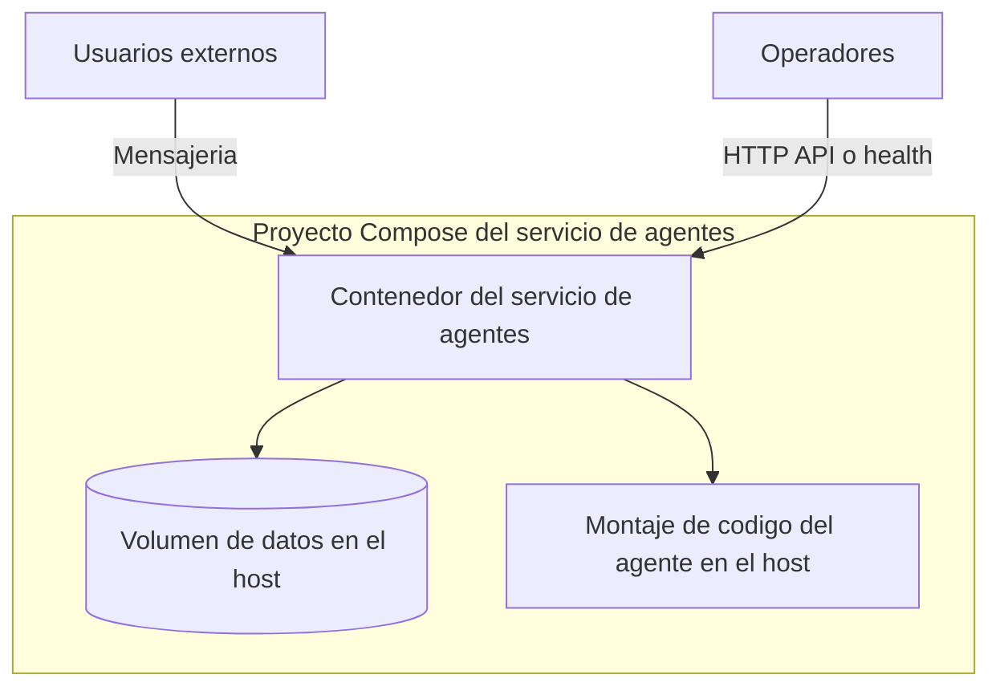

# Servicio de agentes

Es un desplegable **separado** del servicio RAG y de la interfaz web de chat. Empaqueta un runtime de agente (incluye canales de mensajeria opcionales con proveedores de terceros) en una imagen de contenedor publicada por la pila del proveedor de alojamiento.

## Patron Compose (observado)

De un `docker-compose.yml` representativo en el servidor de aplicaciones:

```yaml
# Ilustrativo — no copiar secretos del .env real
services:
  agent-service:
    image: <registro>/<imagen-agente>:latest
    ports:
      - "8642:8642"   # superficie HTTP API opcional
    env_file: [.env]
    volumes:
      - ./agent:/opt/agent    # montaje para git / actualizaciones de codigo
      - ./data:/opt/data
```

Las etiquetas de *reverse proxy* (p. ej. Traefik en `4860`) pueden enrutar la **UI** HTTP principal; el mapeo **8642** suele usarse para API o *health* — confirma con el contenedor en ejecucion y `.env`.



## Relacion con la pila de chat

- **Ortogonal** a la conexion OpenAI por defecto de la interfaz web de chat: el servicio de agentes **no** sustituye a la pasarela de inferencia salvo que cableeis integraciones explicitas.
- Patron futuro opcional: enrutar las llamadas LLM del servicio de agentes por la misma **pasarela** para cuotas y registro unificados.

## Operaciones (alto nivel)

- Montar `./agent` sobre un checkout git del codigo del agente cuando necesiteis actualizaciones tipo `git pull` dentro del layout de la imagen.
- Mantener `.env` fuera de git; rotar las claves API del agente de forma independiente de las de la pasarela.

## Relacionado

- [C4 — Contenedores](c4-containers.md) para resumen de puertos.
- [Patrones de despliegue](deployment-patterns.md) para Compose frente a la pila de UI.
