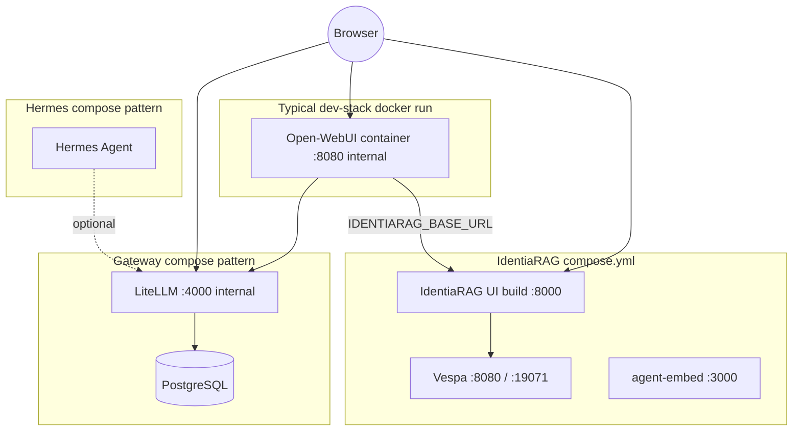

# C4 — Level 2: Containers

Runnable and independently deployable units. Ports shown are **defaults from source**; your host may remap them.

## Port reference (defaults in tree)

| Container / process | Default host port | Notes |
|---------------------|-------------------|--------|
| IdentiaRAG UI (`compose.yml` → `ui`) | `8000` | FastAPI + static UI (`identiarag.api:app`). |
| Vespa | `8080`, `19071` | Query + config server. |
| agent-embed | `3000` | Separate image context `../agent-embed`. |
| Open-WebUI (`dev-stack.sh`) | `3000` → container `8080` | `-p OPEN_WEBUI_HOST_PORT:OPEN_WEBUI_CONTAINER_PORT`. |
| LiteLLm (sample compose) | published by host | Internal app listens on **4000** in example file; host mapping varies. |
| Hermes Agent | `8642` (+ internal `4860`) | Published port for optional API in sample compose. |

## Data volumes (patterns)

- **IdentiaRAG**: `./output`, `./docs`, HuggingFace cache volume in compose.
- **Open-WebUI**: named volume on `/app/backend/data` in `dev-stack.sh` pattern.
- **LiteLLM**: Postgres volume for model registry when DB mode is enabled.

Do **not** document secret values; only **variable names** appear in compose (e.g. `LITELLM_MASTER_KEY`, `DATABASE_URL` pattern).
