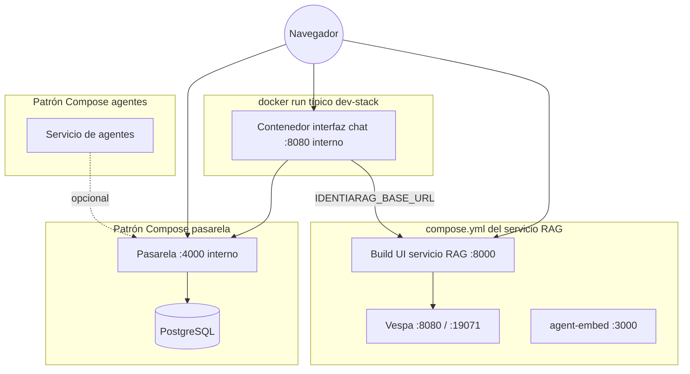

# C4 — Nivel 2: contenedores

Unidades ejecutables e independientes. Los puertos son **valores por defecto del código**; tu host puede remapearlos.

## Referencia de puertos (por defecto en el árbol)

| Contenedor / proceso | Puerto host por defecto | Notas |
|------------------------|-------------------------|--------|
| UI servicio RAG (`compose.yml` → `ui`) | `8000` | FastAPI + UI estática (`identiarag.api:app`). |
| Vespa | `8080`, `19071` | Consulta + *config server*. |
| agent-embed | `3000` | Contexto de imagen aparte `../agent-embed`. |
| Interfaz de chat (`dev-stack.sh`) | `3000` → contenedor `8080` | `-p OPEN_WEBUI_HOST_PORT:OPEN_WEBUI_CONTAINER_PORT`. |
| Pasarela (Compose de ejemplo) | publicado por el host | La app interna escucha en **4000** en el archivo de ejemplo; el mapeo del host varía. |
| Servicio de agentes | `8642` (+ interno `4860`) | Puerto publicado para API opcional en Compose de ejemplo. |

## Volúmenes de datos (patrones)

- **Servicio RAG**: `./output`, `./docs`, volumen de caché HuggingFace en Compose.
- **Interfaz de chat**: volumen con nombre en `/app/backend/data` en el patrón `dev-stack.sh`.
- **Pasarela**: volumen Postgres para registro de modelos si el modo DB está activo.

**No** documentes valores secretos; solo **nombres** de variables en Compose (p. ej. `LITELLM_MASTER_KEY`, patrón `DATABASE_URL`).
