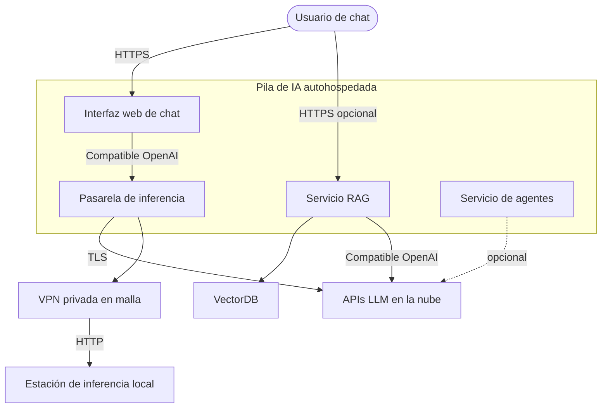

# C4 — Nivel 1: contexto del sistema

Límite de la solución y dependencias externas. Las etiquetas son **lógicas** — sustituye endpoints por los valores de tu entorno fuera de este repo.

## Límites de confianza

1. **Navegador → interfaz web de chat**: autenticación y RBAC los aplica la interfaz; termina TLS en tu *reverse proxy* o borde según política.
2. **Interfaz web de chat → pasarela**: usa una clave **dedicada** de pasarela; evita reutilizar claves maestras de proveedor en el navegador.
3. **Pasarela → inferencia local**: enruta por **malla privada** cuando la API local escucha más allá de localhost.
4. **Servicio RAG → VectorDB**: red Docker en desarrollo; mTLS / tokens para despliegues gestionados en nube.

## Fuera de alcance en este nivel

Matrices de puertos detalladas y rutas de volúmenes: [C4 — Contenedores](c4-containers.md).
