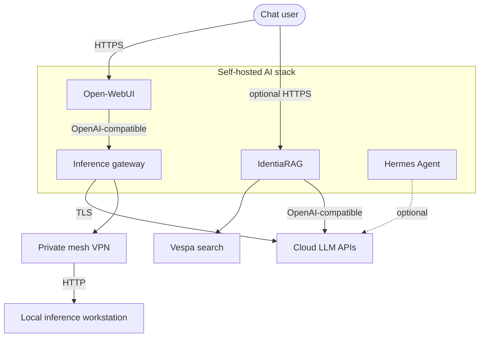

# C4 — Level 1: System context

Solution boundary and external dependencies. All labels are **logical** — replace endpoints with your environment’s values outside this repo.

## Trust boundaries

1. **Browser → Open-WebUI**: authentication and RBAC are enforced by Open-WebUI; terminate TLS at your reverse proxy or edge as required.
2. **Open-WebUI → gateway**: use a **dedicated** gateway key; avoid reusing provider master keys in the browser.
3. **Gateway → local inference**: route over a **private mesh** when the local API listens beyond localhost.
4. **IdentiaRAG → Vespa**: Docker network in dev; mTLS / tokens for Vespa Cloud in production mode.

## Out of scope at this level

Detailed port matrices and volume paths: [C4 — Containers](c4-containers.md).
