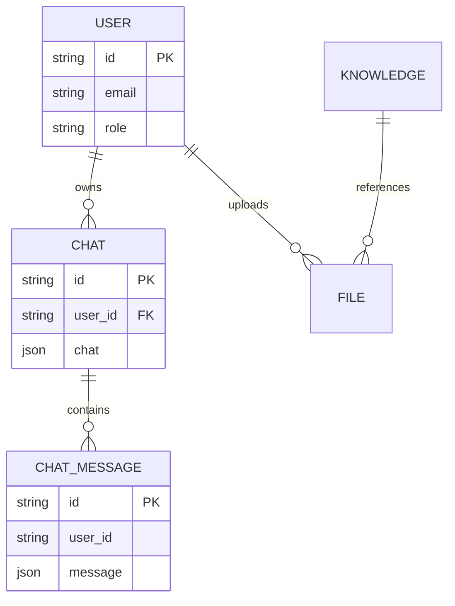
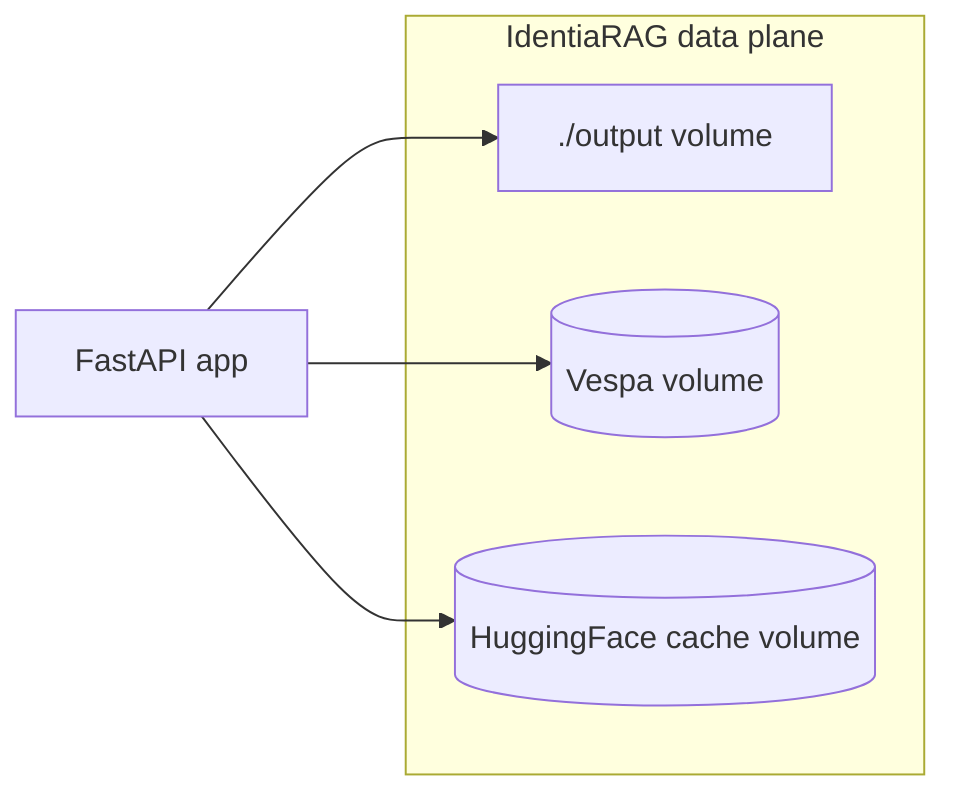

# Data & storage (as-built patterns)

No live credentials or hostnames. Variable **names** match upstream code where applicable.

## Open-WebUI

### Primary database

Configured via `DATABASE_URL` (see `backend/open_webui/env.py`). Defaults to **SQLite** under `DATA_DIR` (`webui.db`). Production deployments often switch to **PostgreSQL** using `DATABASE_TYPE`, `DATABASE_HOST`, `DATABASE_USER`, `DATABASE_PASSWORD`, `DATABASE_NAME`, etc.

The real schema has more tables (`tags`, `folders`, `groups`, …); the diagram shows **conceptual** relationships only.

### Optional Redis

`REDIS_URL` enables distributed cache / rate limiting patterns. Empty URL disables Redis features that depend on it.

### Files & static assets

`DATA_DIR`, `STATIC_DIR`, `FRONTEND_BUILD_DIR` resolve filesystem paths inside the container image. Persist **`DATA_DIR`** on a volume for upgrades without losing chats.

---

## IdentiaRAG

### User settings file

Per `identiarag/api.py`, user settings load from **`~/.identiarag/settings.json`** (path helper `_get_settings_file_path`). Contains UI state such as `active_project`, retrieval `hits`, `k`, etc.

### Vespa

- **Docker mode**: Vespa data in a named volume (`vespa_data` in `compose.yml`).
- **Project output**: host bind mount `./output` for indexed artefacts and exports.
- **Cloud mode**: separate TLS / token configuration (see code paths around `get_cloud_secret_token`).

---

## LiteLLM + PostgreSQL (gateway stack pattern)

When `STORE_MODEL_IN_DB=True`, model definitions and routing metadata live in **PostgreSQL** (`DATABASE_URL` inside the gateway compose project). Back up this database with the same policy as Open-WebUI’s DB if you treat model routing as critical state.

---

## Backup priorities (checklist)

| Store | Why |
|-------|-----|
| Open-WebUI `DATA_DIR` / DB | Users, chats, configuration. |
| Gateway Postgres | Model aliases, fallbacks, usage metadata. |
| IdentiaRAG `output/` + Vespa volume | Indexed corpora; expensive to rebuild. |
| `~/.identiarag/settings.json` | Operator UX state. |

---

## Related

- [Deployment patterns](deployment-patterns.md)
- [C4 — Containers](c4-containers.md)
