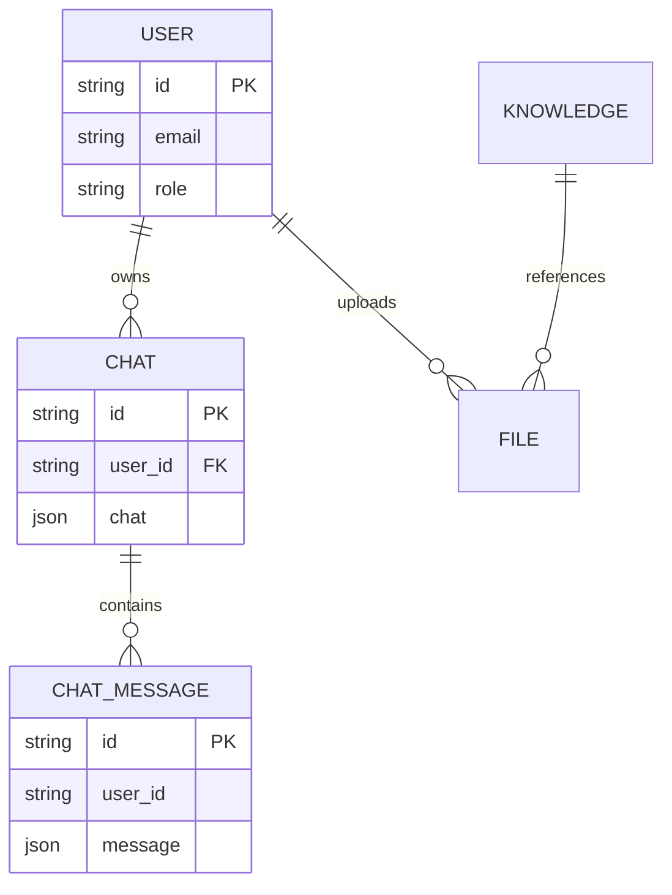
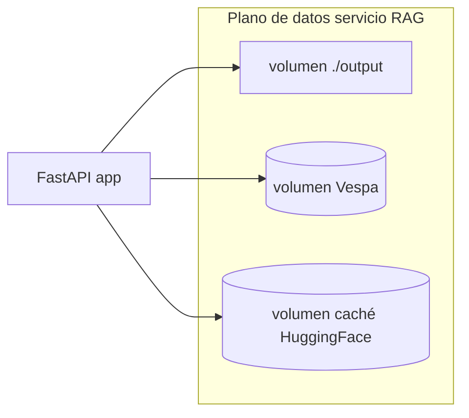

# Datos y almacenamiento (patrones as-built)

Sin credenciales en vivo ni nombres de host. Los **nombres** de variables coinciden con el código *upstream* cuando aplica.

## Interfaz web de chat

### Base de datos principal

Configurada vía `DATABASE_URL` (ver `backend/open_webui/env.py`). Por defecto **SQLite** bajo `DATA_DIR` (`webui.db`). En producción suele usarse **PostgreSQL** con `DATABASE_TYPE`, `DATABASE_HOST`, `DATABASE_USER`, `DATABASE_PASSWORD`, `DATABASE_NAME`, etc.

El esquema real tiene más tablas (`tags`, `folders`, `groups`, …); el diagrama es solo **conceptual**.

### Redis opcional

`REDIS_URL` habilita caché distribuida / límites de tasa. URL vacía desactiva funciones que dependen de Redis.

### Archivos y estáticos

`DATA_DIR`, `STATIC_DIR`, `FRONTEND_BUILD_DIR` resuelven rutas dentro de la imagen. Persiste **`DATA_DIR`** en un volumen para actualizaciones sin perder chats.

---

## Servicio RAG

### Archivo de ajustes de usuario

Según `identiarag/api.py`, los ajustes cargan desde **`~/.identiarag/settings.json`** (helper `_get_settings_file_path`). Contiene estado de UI como `active_project`, `hits`, `k`, etc.

### Vespa

- **Modo Docker**: datos de Vespa en volumen con nombre (`vespa_data` en `compose.yml`).
- **Salida de proyecto**: *bind mount* `./output` para artefactos indexados y exportaciones.
- **Modo nube**: TLS / token aparte (ver rutas de código alrededor de `get_cloud_secret_token`).

---

## Pasarela + PostgreSQL (patrón stack pasarela)

Con `STORE_MODEL_IN_DB=True`, definiciones de modelo y metadatos de enrutado viven en **PostgreSQL** (`DATABASE_URL` en el proyecto Compose de la pasarela). Haz backup de esta base con la misma política que la DB de la interfaz si el enrutado de modelos es estado crítico.

---

## Prioridades de backup (lista de comprobación)

| Almacén | Por qué |
|---------|---------|
| `DATA_DIR` / DB de la interfaz | Usuarios, chats, configuración. |
| Postgres de la pasarela | Alias de modelo, *fallbacks*, metadatos de uso. |
| `output/` del servicio RAG + volumen Vespa | Corpus indexado; costoso de reconstruir. |
| `~/.identiarag/settings.json` | Estado UX del operador. |

---

## Relacionado

- [Patrones de despliegue](deployment-patterns.md)
- [C4 — Contenedores](c4-containers.md)
