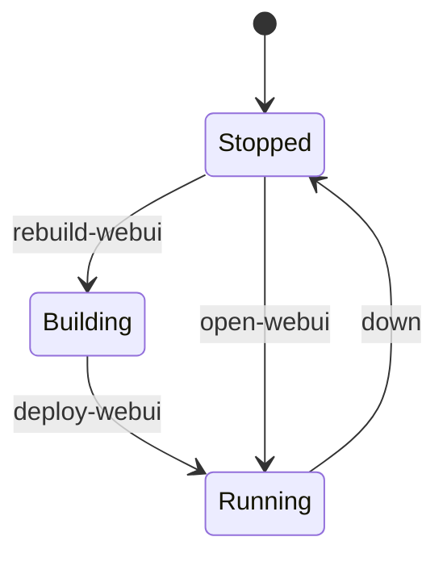

# Patrones de despliegue

## Patrón A — Servicio RAG + VectorDB vía Docker Compose

Usa `compose.yml` en la raíz del repositorio del servicio RAG:

```bash
docker compose up -d
```

Levanta **VectorDB**, el build de imagen **UI del servicio RAG** y opcionalmente **agent-embed** con variables de entorno relacionadas con voz en tiempo real (*LiveKit*).

## Patrón B — Interfaz web de chat vía `dev-stack.sh`

El repo del servicio RAG incluye `dev-stack.sh`:

| Comando | Efecto |
|---------|--------|
| `./dev-stack.sh deploy-webui` | Reconstruye la imagen de la interfaz desde `UI_ROOT` y arranca el contenedor con puerto publicado. |
| `./dev-stack.sh up` | Arranca la interfaz y el servicio RAG en modo segundo plano (ver el script para el comportamiento exacto). |
| `./dev-stack.sh health` | *Health probes* de la pila. |

Variables como `UI_IMAGE`, `UI_HOST_PORT` y `UI_ROOT` ajustan rutas sin editar el script.



## Patrón C — Pasarela y agentes en stacks independientes

La **pasarela** + Postgres y el **servicio de agentes** suelen vivir en **directorios Compose aparte** en el host, gestionados por la UI del proveedor o `docker compose` manual. Comparten *network namespace* **solo si** los unes al mismo bridge definido por el usuario; si no, hablan por puertos publicados en `localhost` o vía *reverse proxy*.

!!! warning "Manejo de secretos"
    Usa `.env` ignorado por git o un gestor de secretos. No versiones `ORQUESTADOR_MASTER_KEY`, contraseñas de base ni tokens de proveedor.

## Patrón D — Sitio de documentación (este repo)

```bash
pip install -r requirements-docs.txt
mkdocs build
```

Salida: sitio estático bajo `site/` listo para subir a `docs.<tu-dominio>`.
