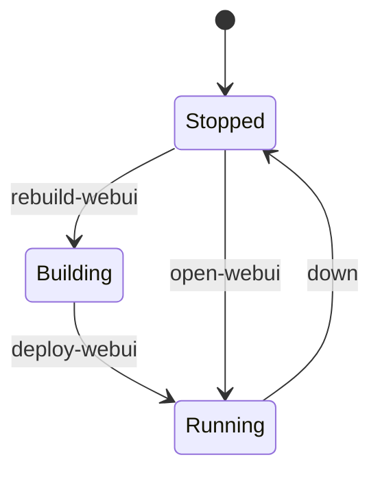

# Deployment patterns

## Pattern A — IdentiaRAG + Vespa via Docker Compose

Use `compose.yml` at the IdentiaRAG repository root:

```bash
docker compose up -d
```

Brings up **Vespa**, the **IdentiaRAG UI** image build, and optionally **agent-embed** with LiveKit-related env vars.

## Pattern B — Open-WebUI via `dev-stack.sh`

The IdentiaRAG repo ships `dev-stack.sh`:

| Command | Effect |
|---------|--------|
| `./dev-stack.sh deploy-webui` | Rebuild Open-WebUI image from `OPEN_WEBUI_ROOT` and run container with published port. |
| `./dev-stack.sh up` | Start Open-WebUI and IdentiaRAG background mode (see script for exact behaviour). |
| `./dev-stack.sh health` | Health probes for the stack. |

Environment variables such as `OPEN_WEBUI_IMAGE`, `OPEN_WEBUI_HOST_PORT`, and `OPEN_WEBUI_ROOT` tune paths without editing the script.



## Pattern C — Independent gateway and agent stacks

LiteLLM + Postgres and Hermes often live in **separate** compose directories on the host, managed by the provider UI or manual `docker compose`. They share the network namespace **only if** you attach them to the same user-defined bridge — otherwise they communicate via published ports on `localhost` or via reverse proxy.

!!! warning "Secret handling"
    Use `.env` files ignored by git or a secret manager. Never commit `LITELLM_MASTER_KEY`, database passwords, or provider tokens.

## Pattern D — Documentation site (this repo)

```bash
pip install -r requirements-docs.txt
mkdocs build
```

Output: static site under `site/` suitable for upload to `docs.<your-domain>`.
