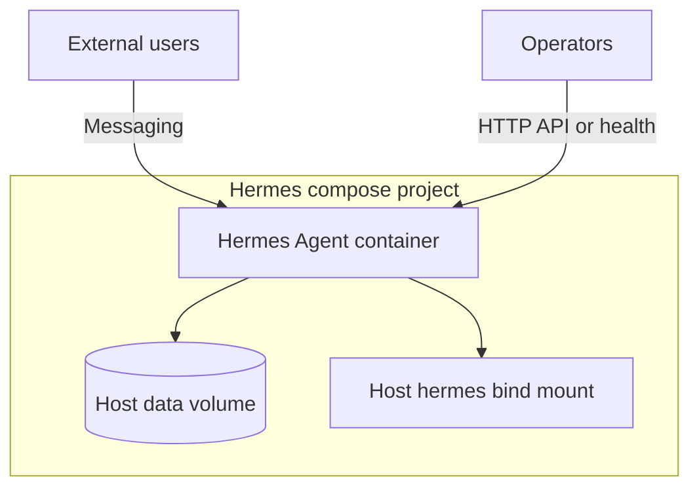

# Hermes Agent

Hermes is a **separate** deployable from IdentiaRAG/Open-WebUI. It packages an agent runtime (including optional messaging channels such as WhatsApp) behind a container image published by the hosting provider stack.

## Compose pattern (observed)

From a representative `docker-compose.yml` on the application server:

```yaml
# Illustrative — do not copy secrets from real .env
services:
  hermes-agent:
    image: ghcr.io/hostinger/hvps-hermes-agent:latest
    ports:
      - "8642:8642"   # optional HTTP API surface
    env_file: [.env]
    volumes:
      - ./hermes:/opt/hermes    # mount for upstream git / code updates
      - ./data:/opt/data
```

Reverse-proxy labels (e.g. Traefik on `4860`) may route the **main** HTTP UI; the **8642** mapping is commonly used for an API or health surface — confirm against your running container and `.env`.



## Relationship to chat stack

- **Orthogonal** to Open-WebUI’s default OpenAI connection: Hermes does not replace LiteLLM unless you explicitly wire integrations.
- Optional future pattern: route Hermes LLM calls through the same **gateway** for unified quotas and logging.

## Operations (high level)

- Mount `./hermes` to a git checkout of upstream Hermes when you need `git pull`-style updates inside the image layout.
- Keep `.env` out of git; rotate API keys used by the agent independently from gateway keys.

## Related

- [C4 — Containers](c4-containers.md) for port summary.
- [Deployment patterns](deployment-patterns.md) for compose vs UI stack.
