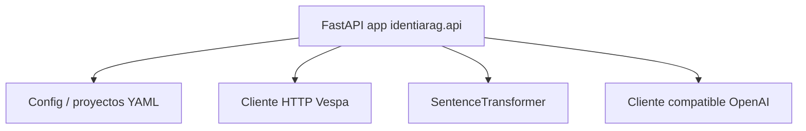
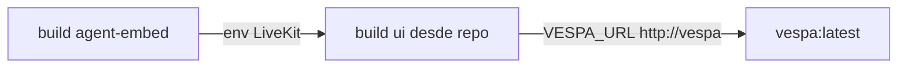

# Servicio RAG — arquitectura de software

## Propósito

Aplicación **Python** para flujos RAG: rastrear o ingerir documentos, indexar en **Vespa** y responder preguntas con **recuperación multi-consulta** y un **LLM compatible OpenAI** tanto para expansión de consulta como para la respuesta final.

Metadatos del paquete (`pyproject.toml`): FastAPI, Uvicorn, `sentence-transformers`, `pyvespa`, `openai`, Scrapy, etc.

## Pipeline de recuperación (alto nivel)

## Puntos de entrada en tiempo de ejecución

| Entrada | Módulo | Transporte |
|---------|--------|------------|
| CLI | `identiarag.cli` → `uvicorn.run(identiarag.api:app, …)` | Servidor HTTP |
| Script de paquete | `identiarag = identiarag.cli:main` | Igual |

La aplicación FastAPI está en `src/identiarag/api.py` (`app = FastAPI(...)`). Existe un árbol paralelo `src/nyrag/` por historial *upstream* / renombre — trata **`identiarag`** como paquete canónico para trabajo nuevo.

## Dependencias clave (en proceso)

## Servicios Docker (`compose.yml`)

Las variables de entorno siguen estilo **12-factor**: claves opcionales LiveKit, Deepgram, ElevenLabs aparecen **solo por nombre** en esta documentación — inyectar vía `.env` o gestor de secretos, nunca versionar valores.

## Vespa local vs nube

El código ramifica según **modo nube** (entorno / estado de la app). Vespa por proyecto en Docker puede omitirse al apuntar a un Vespa local único o con `IDENTIARAG_SKIP_PROJECT_DOCKER` (ver `_use_per_project_vespa_docker_container` en `api.py`).

## Relacionado

- [C4 — Contenedores](c4-containers.md) para puertos.
- [Patrones de despliegue](deployment-patterns.md) para `dev-stack.sh` frente a Compose.
