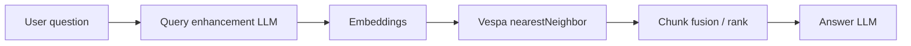
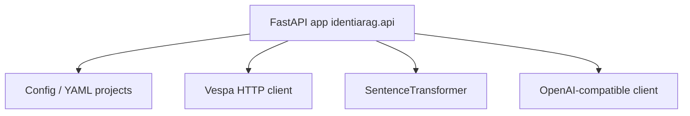

# IdentiaRAG — software architecture

## Purpose

IdentiaRAG is a **Python** application for building RAG flows: crawl or ingest documents, index into **Vespa**, and answer user questions using **multi-query retrieval** and an **OpenAI-compatible** LLM for both query expansion and final answers.

Package metadata (`pyproject.toml`): FastAPI, Uvicorn, `sentence-transformers`, `pyvespa`, `openai`, Scrapy, etc.

## High-level retrieval pipeline

## Runtime entrypoints

| Entry | Module | Transport |
|-------|--------|-----------|
| CLI | `identiarag.cli` → `uvicorn.run(identiarag.api:app, …)` | HTTP server |
| Package script | `identiarag = identiarag.cli:main` | Same |

The FastAPI application is defined in `src/identiarag/api.py` (`app = FastAPI(...)`). A parallel tree `src/nyrag/` exists from upstream/rebrand history — treat **`identiarag`** as the canonical product package for new work.

## Key dependencies (in-process)

## Docker services (`compose.yml`)

Environment variables follow **12-factor** style: optional LiveKit, Deepgram, ElevenLabs keys are referenced by **name** only in this documentation — inject via `.env` or secret manager, never commit values.

## Cloud vs local Vespa

Application code branches on **cloud mode** (environment / app state). Docker-per-project Vespa can be skipped when pointing to a single local Vespa or when `IDENTIARAG_SKIP_PROJECT_DOCKER` is set (see `_use_per_project_vespa_docker_container` in `api.py`).

## Related

- [C4 — Containers](c4-containers.md) for ports.
- [Deployment patterns](deployment-patterns.md) for `dev-stack.sh` vs compose.
