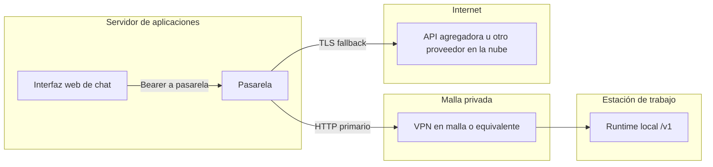
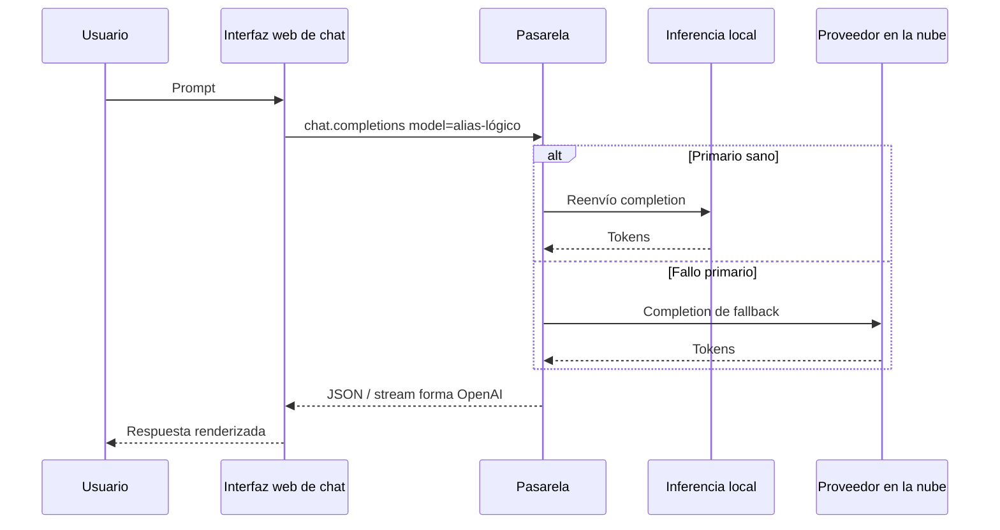

# Pasarela de inferencia (híbrido local + nube)

Describe el **patrón** desplegado junto a la interfaz web de chat: una única **pasarela compatible OpenAI** (en el despliegue de referencia se usa un producto concreto de ese tipo) con inferencia **local** opcional en estación de trabajo y **fallback** en la nube.

!!! note "Sin credenciales en vivo"
    No almacenes `LITELLM_MASTER_KEY`, claves de proveedor ni IPs de red privada en este repositorio. Configúralas solo en el entorno de ejecución.

## Arquitectura lógica

## Camino de la petición (conceptual)

1. El usuario elige un **alias lógico** (ejemplo: `lm-auto`) en la interfaz web de chat.
2. La interfaz envía `POST /v1/chat/completions` a la pasarela.
3. La pasarela resuelve el alias hacia:
   - **Primario**: URL compatible OpenAI de la **inferencia local** (solo alcanzable por IP privada / malla).
   - **Fallback**: ruta de modelo en la nube (p. ej. vía API agregadora) cuando el primario no responde.
4. La respuesta vuelve a la interfaz sin cambiar el contrato de la API.

## Conceptos de configuración de la pasarela

| Concepto | Rol |
|----------|-----|
| `STORE_MODEL_IN_DB` | Si es true, lista de modelos y despliegues pueden editarse por UI/API respaldados por PostgreSQL. |
| Clave maestra | Token Bearer exigido en endpoints de la pasarela; la interfaz guarda el **mismo** valor como «clave API OpenAI» de esa conexión. |
| API de fallback | Registro explícito de modelos de *fallback* por alias evita errores «sin fallback» en tiempo de ejecución. |

## Runtime local en la estación de trabajo

El servidor local debe escuchar en **`0.0.0.0`** (no solo `127.0.0.1`) si otra máquina (la VPS) reenvía tráfico por la malla.

## Alineación con documentación operativa interna

El detalle operativo para un conjunto de hosts concreto vive en el árbol `docs/` del repositorio **devops** (arquitectura y runbooks), no duplicado aquí para evitar deriva y filtrado de secretos.
