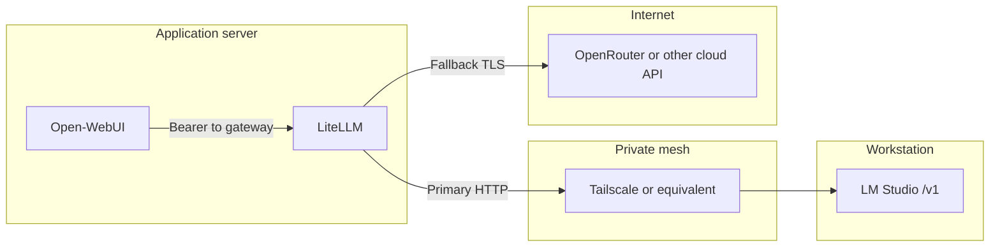
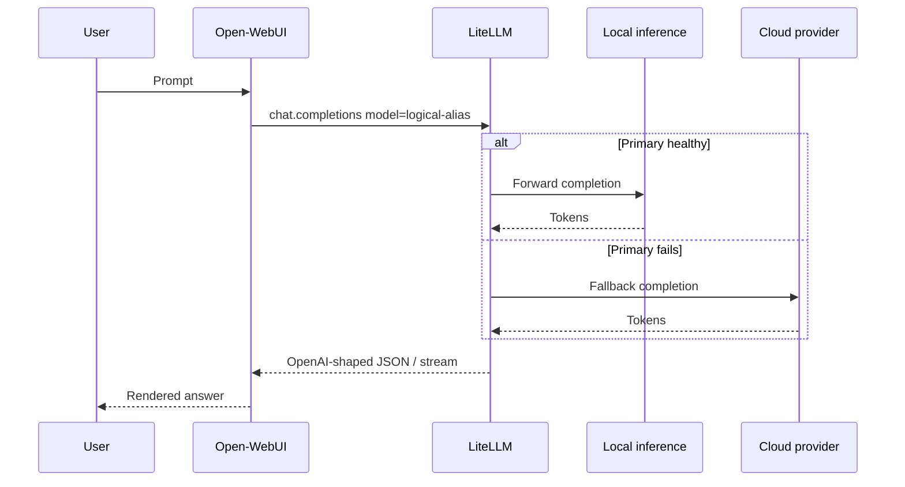

# Inference gateway (hybrid local + cloud)

This page describes the **pattern** implemented alongside Open-WebUI: a single **OpenAI-compatible gateway** (LiteLLM is the concrete product used in the reference deployment) with optional **local** inference on a workstation and **cloud** fallback.

!!! note "No live credentials"
    Do not store `LITELLM_MASTER_KEY`, provider keys, or tailnet IPs in this repository. Configure them only in your runtime environment.

## Logical architecture

## Request path (conceptual)

1. User selects a **logical alias** (example: `lm-auto`) in Open-WebUI.
2. Open-WebUI sends `POST /v1/chat/completions` to the gateway.
3. Gateway resolves the alias to:
   - **Primary**: OpenAI-compatible URL of **local inference** (reachable only via private IP / mesh).
   - **Fallback**: cloud model route (e.g. via OpenRouter) when the primary is unreachable.
4. Response returns to Open-WebUI unchanged at the API contract level.

## Gateway configuration concepts

| Concept | Role |
|---------|------|
| `STORE_MODEL_IN_DB` | When true, model list and deployments may be edited via UI/API backed by PostgreSQL. |
| Master key | Bearer token required on gateway endpoints; Open-WebUI stores the **same** value as its “OpenAI API key” for that connection. |
| Fallback API | Explicit registration of fallback models per logical alias avoids “no fallback configured” errors at runtime. |

## LM Studio on the workstation

Local server must listen on **`0.0.0.0`** (not only `127.0.0.1`) if another machine (the VPS) forwards traffic via the mesh.

## Alignment with internal branded doc

Operational detail for a specific host set lives in your **devops** repository’s branded architecture/runbook markdown (not duplicated here to avoid drift and secret leakage).
