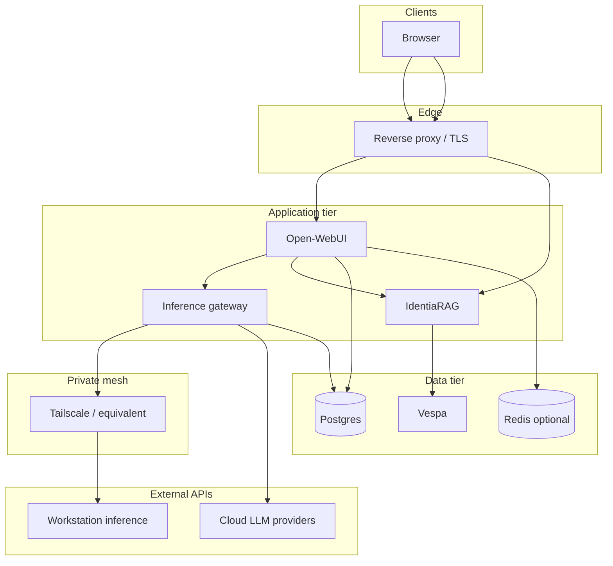

# Network & security matrix

Logical flows only. Replace interface names and CIDRs with your organisation’s standards.

## Caller → callee matrix

## Port classes

| Class | Examples | Hardening |
|-------|----------|-----------|
| **Public HTTPS** | Reverse proxy → Open-WebUI / IdentiaRAG | TLS 1.2+, WAF optional, auth required. |
| **Internal only** | Gateway ↔ Postgres, Open-WebUI ↔ Redis | Bind to loopback or private Docker network; no WAN exposure. |
| **Mesh-only** | Gateway → workstation inference | ACL on mesh; inference process must not trust the public Internet. |
| **Provider egress** | Gateway → OpenRouter / OpenAI | Outbound allowlist; per-key quotas. |

## Secrets (policy)

| Secret type | Store in | Never |
|-------------|----------|-------|
| Gateway master key | Secret manager / `.env` on server | Commit to git, paste in docs. |
| Provider API keys | Gateway env or vault | Send to browser clients except via server-side proxy. |
| DB passwords | Compose env / vault | Log in plain text. |

## Related

- [Inference gateway](inference-gateway.md)
- [Operations runbook](operations-runbook.md)
