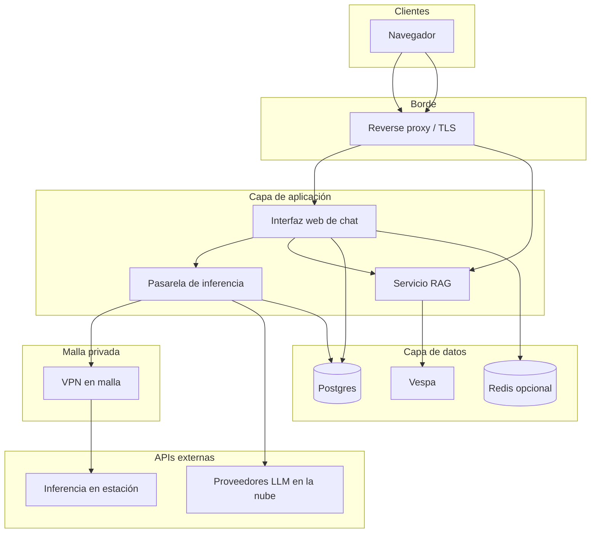

# Red y matriz de seguridad

Solo flujos **lógicos**. Sustituye nombres de interfaz y CIDR por los estándares de tu organización.

## Matriz llamador → llamado

## Clases de puerto

| Clase | Ejemplos | Endurecimiento |
|-------|----------|----------------|
| **HTTPS público** | *Reverse proxy* → interfaz / servicio RAG | TLS 1.2+, WAF opcional, autenticación obligatoria. |
| **Solo interno** | Pasarela ↔ Postgres, interfaz ↔ Redis | Enlazar a loopback o red Docker privada; sin exposición WAN. |
| **Solo malla** | Pasarela → inferencia en estación | ACL en la malla; el proceso de inferencia no debe confiar en Internet público. |
| **Egreso a proveedor** | Pasarela → API agregadora / OpenAI | Lista blanca saliente; cuotas por clave. |

## Secretos (política)

| Tipo de secreto | Dónde guardarlo | Nunca |
|-----------------|-----------------|-------|
| Clave maestra de pasarela | Gestor de secretos / `.env` en servidor | En git, pegado en docs. |
| Claves API de proveedor | Entorno de pasarela o *vault* | En clientes de navegador salvo por proxy servidor. |
| Contraseñas DB | Compose env / *vault* | En logs en claro. |

## Relacionado

- [Pasarela de inferencia](inference-gateway.md)
- [Runbook operativo](operations-runbook.md)
