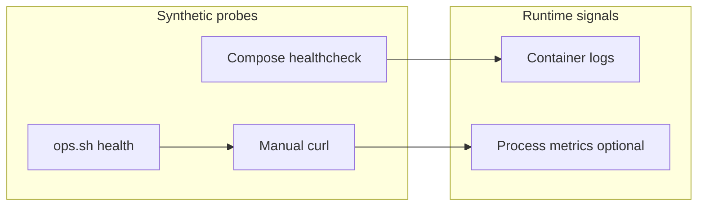

# Observability

What you can rely on **today** from the codebase and compose files, plus explicit gaps.

## Health endpoints (patterns)

| Component | Endpoint pattern | Source |
|-----------|------------------|--------|
| IdentiaRAG UI (compose) | `GET /health` on service port | `compose.yml` healthcheck |
| Vespa | Config server `ApplicationStatus` | `compose.yml` healthcheck |
| LiteLLM (sample compose) | `GET /health/liveliness` on container port **4000** | `docker-compose.yml` in gateway project |
| Hermes | Depends on image; use published API port health if available | compose port mapping |

Open-WebUI exposes many routes; use container logs and upstream **Open WebUI** documentation for optional `/health` variants in newer releases.

## Logging

- **Docker**: `docker logs -f <container>` for Open-WebUI, IdentiaRAG, Vespa, LiteLLM, Hermes.
- **IdentiaRAG**: Python logging via `identiarag.logger` helpers.
- **Open-WebUI**: structured logs from FastAPI / Uvicorn; tune log level with env vars documented upstream.

## Metrics & tracing (gap)

- **Metrics**: no first-class Prometheus exposition is documented in this solution snapshot; treat as **gap** unless you add a sidecar or application instrumentation.
- **Distributed tracing**: not wired by default; enable at reverse proxy or gateway if required.

## Dashboards

Technical-debt / coverage dashboards may live alongside **devops** automation (see [Internal references](../meta/internal-references.md)). They are **not** prerequisites for running the stack.

## Related

- [Operations runbook](operations-runbook.md)
- [C4 — Containers](c4-containers.md)
