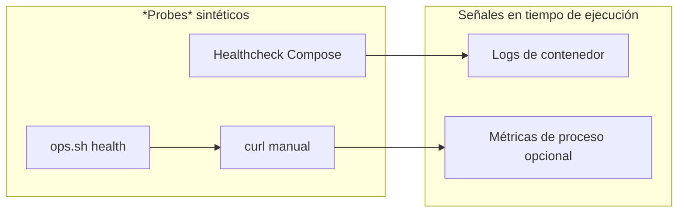

# Observabilidad

En qué puedes apoyarte **hoy** según código y Compose, más brechas explícitas.

## Endpoints de salud (patrones)

| Componente | Patrón de endpoint | Fuente |
|------------|-------------------|--------|
| UI servicio RAG (Compose) | `GET /health` en el puerto del servicio | *healthcheck* en `compose.yml` |
| Vespa | *ApplicationStatus* del *config server* | *healthcheck* en `compose.yml` |
| Pasarela (Compose de ejemplo) | `GET /health/liveliness` en puerto de contenedor **4000** | `docker-compose.yml` del proyecto pasarela |
| Servicio de agentes | Depende de la imagen; usar *health* del puerto API publicado si existe | mapeo de puertos Compose |

La interfaz web de chat expone muchas rutas; usa logs del contenedor y la documentación del proyecto de chat *upstream* para variantes opcionales de `/health` en versiones nuevas.

## Logging

- **Docker**: `docker logs -f <contenedor>` para interfaz, servicio RAG, Vespa, pasarela, servicio de agentes.
- **Servicio RAG**: logging Python vía helpers `identiarag.logger`.
- **Interfaz web de chat**: logs estructurados FastAPI / Uvicorn; nivel con variables documentadas *upstream*.

## Métricas y *tracing* (brecha)

- **Métricas**: no hay exposición Prometheus de primera clase documentada en esta instantánea; trátalo como **brecha** salvo que añadas *sidecar* o instrumentación.
- ***Tracing* distribuido**: no cableado por defecto; habilitar en *reverse proxy* o pasarela si hace falta.

## Tableros

Tableros de deuda técnica / cobertura pueden vivir junto a la automatización **devops** (ver [Referencias internas](../meta/internal-references.md)). **No** son requisito para ejecutar la pila.

## Relacionado

- [Runbook operativo](operations-runbook.md)
- [C4 — Contenedores](c4-containers.md)
