# Interfaz web de chat — routers HTTP (vista por componentes)

Mapa de **routers FastAPI** registrados en el módulo principal del backend de UI (`backend/<ui_backend>/main.py`, instantánea del fork). Los *feature flags* pueden omitir routers (p. ej. SCIM, analíticas admin).

## Diagrama de routers

```mermaid
flowchart TB
  subgraph transport [Transporte]
    APP[FastAPI app]
    WS["/ws WebSocket"]
  end

  subgraph integrations [Ejecutores de modelo]
    OLL["/ollama"]
    OAI["/openai"]
  end

  subgraph api [REST versionado /api/v1]
    PIP[pipelines]
    TSK[tasks]
    IMG[images]
    AUD[audio]
    RET[retrieval]
    CFG[configs]
    AUTH[auths]
    USR[users]
    CHN[channels]
    CHT[chats]
    NTE[notes]
    MDL[models]
    KNO[knowledge]
    PRM[prompts]
    TOL[tools]
    SKL[skills]
    MEM[memories]
    FLD[folders]
    GRP[groups]
    FIL[files]
    FUN[functions]
    EVL[evaluations]
    ANA[analytics optional]
    UTL[utils]
    TRM[terminals]
    SCM[scim optional]
  end

  APP --> WS
  APP --> OLL
  APP --> OAI
  APP --> PIP
  APP --> TSK
  APP --> IMG
  APP --> AUD
  APP --> RET
  APP --> CFG
  APP --> AUTH
  APP --> USR
  APP --> CHN
  APP --> CHT
  APP --> NTE
  APP --> MDL
  APP --> KNO
  APP --> PRM
  APP --> TOL
  APP --> SKL
  APP --> MEM
  APP --> FLD
  APP --> GRP
  APP --> FIL
  APP --> FUN
  APP --> EVL
  APP --> ANA
  APP --> UTL
  APP --> TRM
  APP --> SCM
```

## Tabla de prefijos

| Prefijo | Propósito (resumen) |
|---------|---------------------|
| `/ws` | Canal en tiempo real / *streaming* (paquete `socket`). |
| `/ollama` | Endpoints compatibles con el protocolo habitual del motor local (nombre de ruta histórico en código). |
| `/openai` | Proxy compatible OpenAI y llamadas a herramientas hacia pasarelas externas. |
| `/api/v1/pipelines` | Plugins de *pipeline*. |
| `/api/v1/tasks` | Tareas en segundo plano. |
| `/api/v1/images` | Integraciones de generación / edición de imágenes. |
| `/api/v1/audio` | Rutas STT/TTS. |
| `/api/v1/retrieval` | Configuración y ejecución de recuperación RAG. |
| `/api/v1/configs` | Configuración en tiempo de ejecución. |
| `/api/v1/auths` | Inicio de sesión, tokens, OAuth. |
| `/api/v1/users` | Perfiles y operaciones admin. |
| `/api/v1/channels` | Canales / espacios de trabajo. |
| `/api/v1/chats` | Sesiones y mensajes. |
| `/api/v1/notes` | Notas. |
| `/api/v1/models` | Lista y metadatos de modelos. |
| `/api/v1/knowledge` | Colecciones de conocimiento. |
| `/api/v1/prompts` | Prompts guardados. |
| `/api/v1/tools` | Definiciones de herramientas. |
| `/api/v1/skills` | *Skills* (paquetes estructurados de herramientas). |
| `/api/v1/memories` | Almacén de memoria a largo plazo. |
| `/api/v1/folders` | Jerarquía de carpetas para chats/archivos. |
| `/api/v1/groups` | Grupos RBAC. |
| `/api/v1/files` | Archivos subidos. |
| `/api/v1/functions` | Funciones Python expuestas a modelos. |
| `/api/v1/evaluations` | Flujos de evaluación. |
| `/api/v1/analytics` | Analíticas admin (*flag* opcional). |
| `/api/v1/utils` | Utilidades varias. |
| `/api/v1/terminals` | Integración de terminal web. |
| `/api/v1/scim/v2` | Aprovisionamiento SCIM (*flag* opcional). |

## Modelos SQLAlchemy (`backend/<ui_backend>/models/`)

Módulos representativos: `chats`, `chat_messages`, `users`, `auths`, `knowledge`, `files`, `groups`, `memories`, `tools`, `functions`, … — ver [Datos y almacenamiento](data-and-storage.md).

## Relacionado

- [Interfaz web de chat — software](open-webui-software.md)
- [Secuencias de peticiones](sequence-requests.md)
