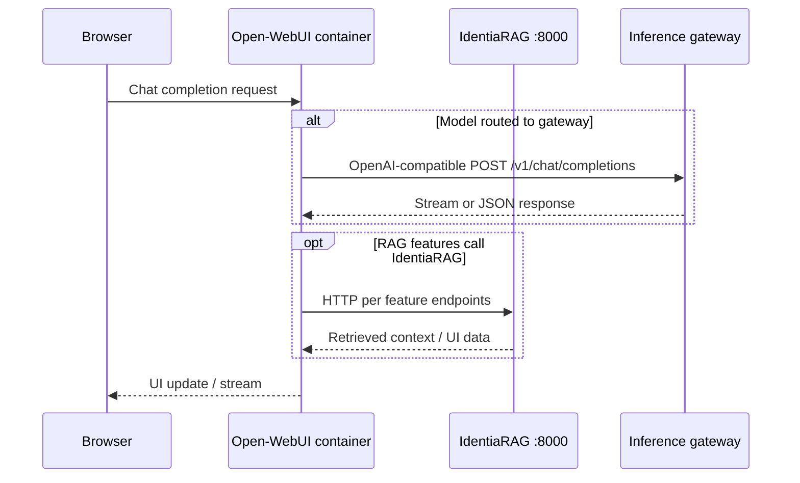

# Open-WebUI — software architecture

## Purpose

**Open WebUI** (this fork, version in `package.json`) is a self-hosted AI platform: chat UI, model management, RAG features, tools, and integrations with **Ollama** and **OpenAI-compatible** providers.

Upstream marketing and full feature list live in the project `README.md`; this page focuses on **structure** relevant to integration with IdentiaRAG and an external inference gateway.

## Process model

The backend entrypoint is `backend/open_webui/main.py` (large FastAPI application with SQLAlchemy, optional Redis, background tasks).

## Integration with IdentiaRAG (dev pattern)

`dev-stack.sh` runs the Open-WebUI container with:

- `IDENTIARAG_BASE_URL` pointing at the IdentiaRAG API on the **host** (`host.docker.internal:8000` pattern) so the chat UI can call RAG endpoints from inside the container.

## Fork maintenance

Track deliberate differences from upstream (themes, branding, patches) in your own `CHANGELOG` or `README_CUSTOM_MODIFICATIONS` if present. Version `0.8.12` in `package.json` is the **fork baseline** at documentation time — update when you bump.

## Related

- [Open-WebUI routers](open-webui-routers.md) for the FastAPI route map.
- [Inference gateway](inference-gateway.md) for LiteLLM-centric routing.
- [Deployment patterns](deployment-patterns.md) for image build and `docker run` flags.
