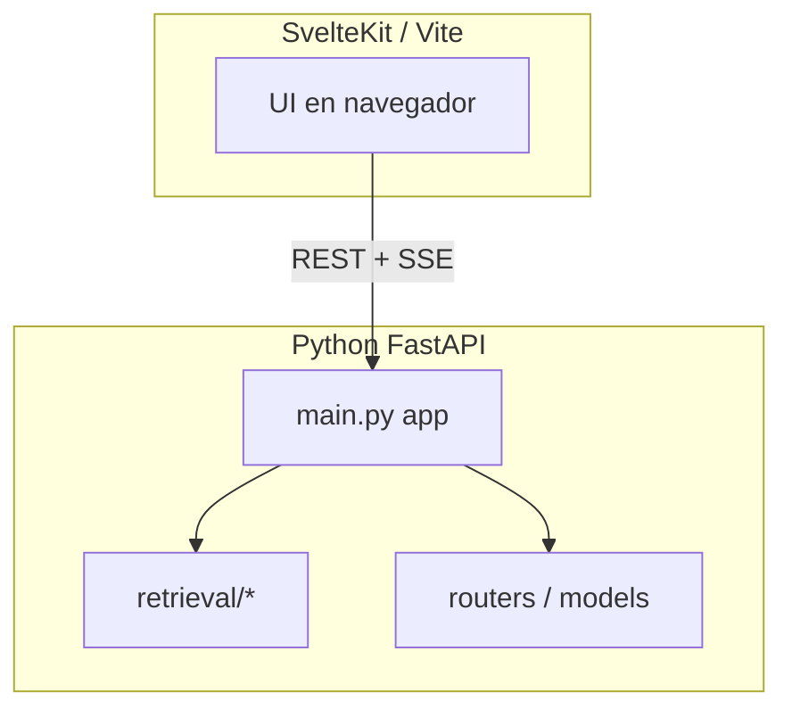
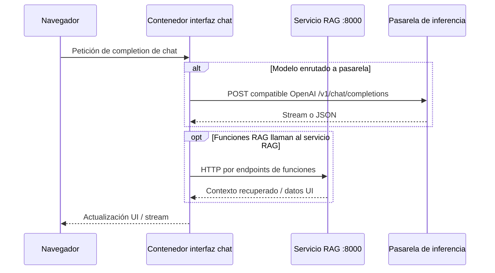

# Interfaz web de chat — arquitectura de software

## Propósito

**Interfaz web de chat** (este fork, versión en `package.json`): plataforma de IA autohospedada — UI de chat, gestión de modelos, funciones RAG, herramientas e integración con **motores locales de inferencia** y proveedores **compatibles OpenAI**.

El marketing y el listado completo de funciones están en el `README.md` del proyecto; esta página se centra en la **estructura** relevante para integrar el **servicio RAG** y una **pasarela de inferencia** externa.

## Modelo de proceso

El backend arranca en `backend/open_webui/main.py` (gran aplicación FastAPI con SQLAlchemy, Redis opcional, tareas en segundo plano).

## Integración con el servicio RAG (patrón dev)

`dev-stack.sh` ejecuta el contenedor de la interfaz con:

- `IDENTIARAG_BASE_URL` apuntando a la API del servicio RAG en el **host** (patrón `host.docker.internal:8000`) para que la UI llame a endpoints RAG desde dentro del contenedor.

## Mantenimiento del fork

Registra las diferencias deliberadas respecto al *upstream* (temas, parches) en vuestro propio `CHANGELOG` o `README_CUSTOM_MODIFICATIONS` si existe. La versión `0.8.12` en `package.json` es la **línea base del fork** en el momento de la documentación — actualízala al subir versión.

## Relacionado

- [Routers HTTP](open-webui-routers.md) para el mapa de rutas FastAPI.
- [Pasarela de inferencia](inference-gateway.md) para enrutado centrado en la pasarela.
- [Patrones de despliegue](deployment-patterns.md) para build de imagen y flags `docker run`.
