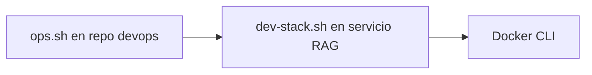

# Runbook operativo (alto nivel)

Comandos y rutas son **relativos a repositorios** — define tus propias ubicaciones de clone vía variables de entorno donde se soporte.

## Orquestación de la pila

El repositorio **devops** incluye `ops.sh`, que delega en `dev-stack.sh` del **servicio RAG** salvo override:

| Variable | Efecto |
|----------|--------|
| `DEVOPS_STACK_SCRIPT` | Ruta absoluta al script de pila a ejecutar. |
| `DEVOPS_IDENTIARAG_ROOT` | Raíz del checkout del servicio RAG; usa `<root>/dev-stack.sh`. |

Comandos típicos de `ops.sh` (ver `--help` del script): `status`, `health`, `deploy-webui`, `up`, `down`, `logs`, `doctor`, `smoke`.



## Servicio RAG + Compose VectorDB

Desde la raíz del repositorio del servicio RAG:

```bash
docker compose up -d
```

Usa `docker compose ps` y *healthchecks* definidos en `compose.yml` (VectorDB `ApplicationStatus`, UI `curl /health`).

## Ciclo de vida de la imagen de la interfaz

Desde el servicio RAG (vía `dev-stack.sh` u `ops.sh`):

- **Rebuild / deploy** — construye la etiqueta configurada por `OPEN_WEBUI_IMAGE` (patrón por defecto `open-webui:local`) desde `OPEN_WEBUI_ROOT`.

## Pasarela de inferencia y servicio de agentes

Suelen vivir en **proyectos Compose separados** en el host. Operarlos con `docker compose` desde sus directorios: `up`, `down`, `logs`, `exec` para depuración.

!!! warning "Secretos"
    Tras cualquier cambio, verifica que los `.env` sigan excluidos del control de versiones y de este repo documental.

## Orden de triage ante incidentes

1. **Salud de contenedores** — `docker ps`, *healthchecks* de Compose.
2. **Logs** — `docker logs <contenedor>` (pasarela, interfaz, servicio RAG, VectorDB).
3. **Conectividad** — desde el servidor de apps, `curl` a URLs **internas** (pasarela `/health`, servicio RAG `/health` si está expuesto).
4. **Malla / inferencia local** — si usáis enrutado híbrido, verificar estado de la VPN antes de depurar código de aplicación.

## Documentación operativa detallada

Los runbooks de bajo nivel (pasarela concreta, comprobaciones de VPN en malla, etc.) deben permanecer en el árbol `docs/` del repositorio **devops** para actualizarse con la infraestructura — **no** duplicar secretos aquí.

## Relacionado

- [Patrones de despliegue](deployment-patterns.md)
- [Observabilidad](observability.md)
- [Meta — Referencias internas](../meta/internal-references.md)
