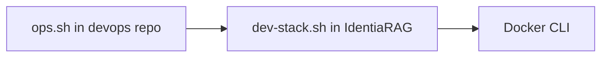

# Operations runbook (high level)

Commands and paths are described **relative to repositories** — set your own clone locations via environment variables where supported.

## Stack orchestration

The **devops** repository ships `ops.sh`, which delegates to **IdentiaRAG**’s `dev-stack.sh` unless overridden:

| Variable | Effect |
|----------|--------|
| `DEVOPS_STACK_SCRIPT` | Absolute path to the stack script to run. |
| `DEVOPS_IDENTIARAG_ROOT` | Root of IdentiaRAG checkout; uses `<root>/dev-stack.sh`. |

Typical `ops.sh` commands (see script `--help`): `status`, `health`, `deploy-webui`, `up`, `down`, `logs`, `doctor`, `smoke`.



## IdentiaRAG + Vespa compose

From the IdentiaRAG repository root:

```bash
docker compose up -d
```

Use `docker compose ps` and service healthchecks defined in `compose.yml` (Vespa `ApplicationStatus`, UI `curl /health`).

## Open-WebUI image lifecycle

From IdentiaRAG (via `dev-stack.sh` or `ops.sh`):

- **Rebuild / deploy** — builds the image tag configured by `OPEN_WEBUI_IMAGE` (default pattern `open-webui:local`) from `OPEN_WEBUI_ROOT`.

## Inference gateway & Hermes

These stacks usually live in **separate** compose projects on the host. Operate them with `docker compose` from their own directories: `up`, `down`, `logs`, `exec` for debugging.

!!! warning "Secrets"
    After any change, verify `.env` files are still excluded from version control and from this documentation repo.

## Incident triage order

1. **Container health** — `docker ps`, compose healthchecks.
2. **Logs** — `docker logs <container>` (gateway, Open-WebUI, IdentiaRAG, Vespa).
3. **Connectivity** — from the app server, curl **internal** URLs (gateway `/health`, IdentiaRAG `/health` if exposed).
4. **Mesh / local inference** — if using hybrid routing, verify VPN status before debugging application code.

## Deeper operational docs

Authoritative low-level runbooks (branded gateway, Tailscale checks, etc.) should stay in the **devops** repository’s `docs/` tree so they can be updated alongside infrastructure — **do not** duplicate secrets here.

## Related

- [Deployment patterns](deployment-patterns.md)
- [Observability](observability.md)
- [Meta — Internal references](../meta/internal-references.md)
