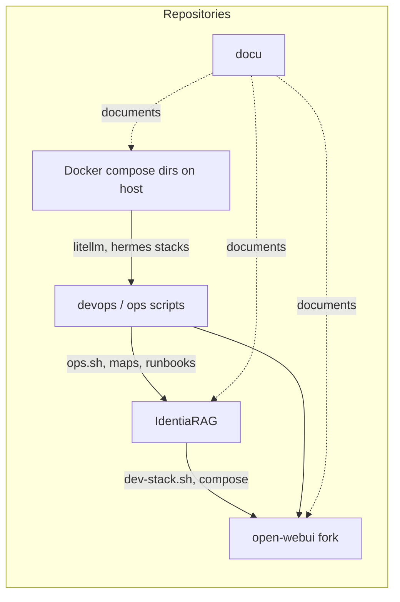

# Repository map

Tracked repositories that form the solution (names illustrative; clone URLs are organisation-specific).

| Repository / artefact | Role |
|------------------------|------|
| **IdentiaRAG** | RAG engine, Vespa integration, FastAPI `identiarag.api:app`, CLI `identiarag`. |
| **open-webui** (fork) | Chat product; build produces image tag such as `open-webui:local` used by `dev-stack.sh`. |
| **devops** | Operational scripts, architecture markdown, technical-debt dashboard assets (path varies per host). |
| **docu** (this repo) | Human-facing documentation site source (MkDocs). |
| **Host compose directories** | Independent Docker Compose projects (e.g. inference gateway DB + proxy, Hermes) managed outside `dev-stack.sh` on some hosts. |

**Path convention (development host):** teams often clone sibling directories (e.g. `open-webui` next to `IdentiaRAG`) so `IDENTIARAG_ROOT` / `OPEN_WEBUI_ROOT` resolve correctly in `dev-stack.sh`. Exact filesystem layout is **not** committed here.
