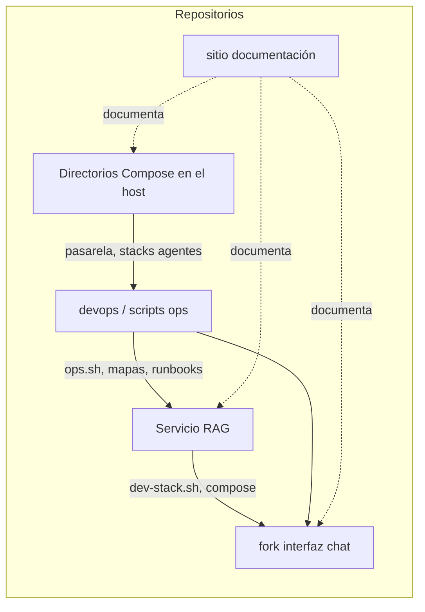

# Mapa de repositorios

Repositorios versionados que forman la solución (nombres ilustrativos; las URLs de clone son propias de cada organización).

| Repositorio / artefacto | Rol |
|-------------------------|-----|
| **Servicio RAG** | Motor RAG, integración VectorDB, FastAPI `identiarag.api:app`, CLI `identiarag`. |
| **Fork interfaz chat** | Producto de chat; el build produce una etiqueta de imagen (p. ej. `open-webui:local`) usada por `dev-stack.sh`. |
| **devops** | Scripts operativos, markdown de arquitectura, activos de tablero de deuda (ruta variable por host). |
| **Este repo** | Fuente del sitio MkDocs de documentación humana. |
| **Directorios Compose en el host** | Proyectos Docker Compose independientes (p. ej. DB + proxy de pasarela, servicio de agentes) gestionados fuera de `dev-stack.sh` en algunos hosts. |

**Convención de rutas (host de desarrollo):** suele clonarse en directorios hermanos (p. ej. carpeta del fork junto al del servicio RAG) para que `IDENTIARAG_ROOT` / `UI_ROOT` resuelvan bien en `dev-stack.sh`. El layout exacto del filesystem **no** se versiona aquí.
