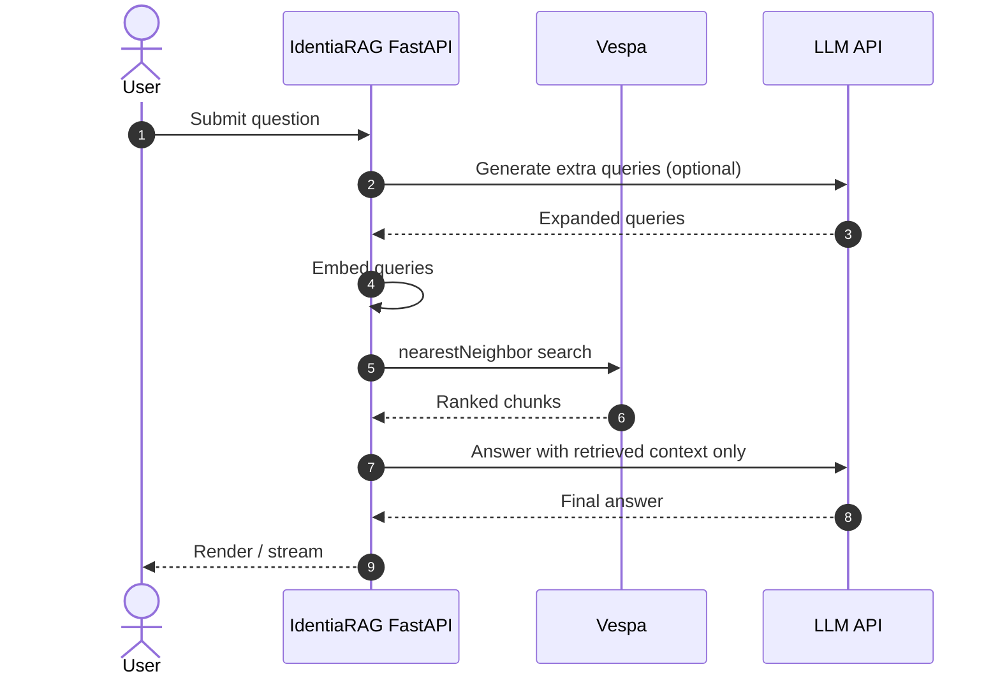
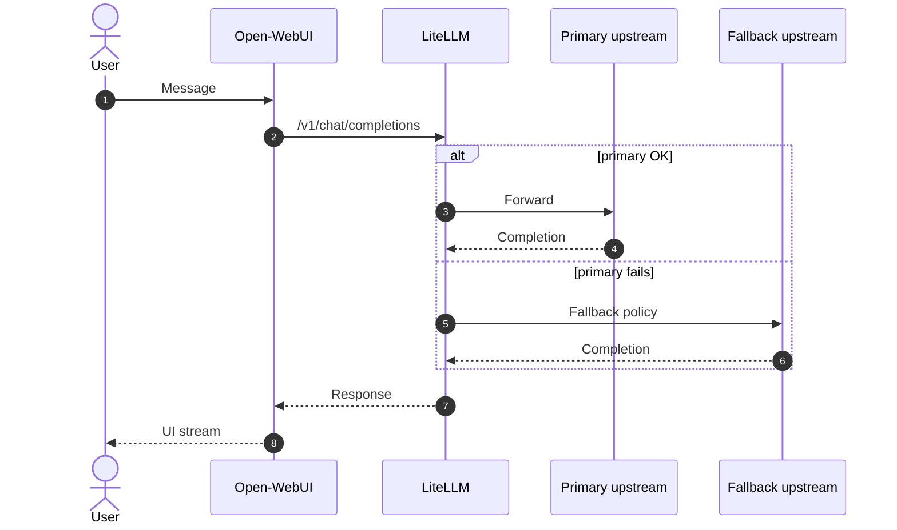
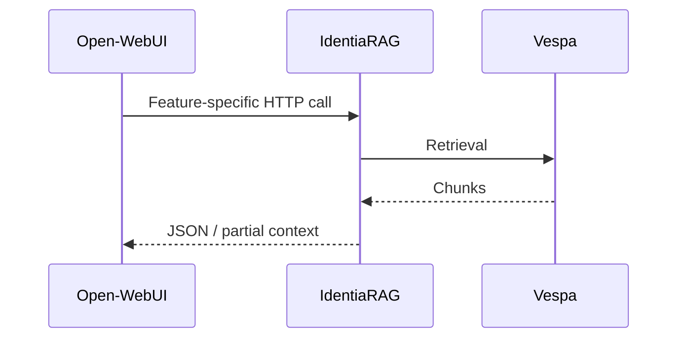

# Request sequences

End-to-end views without embedding environment-specific URLs.

## RAG question (IdentiaRAG UI)

## Chat via Open-WebUI through gateway

## Optional: Open-WebUI calls IdentiaRAG for RAG features

Exact paths depend on fork configuration; trace calls starting at Open-WebUI backend routers that reference `IDENTIARAG_BASE_URL`.
