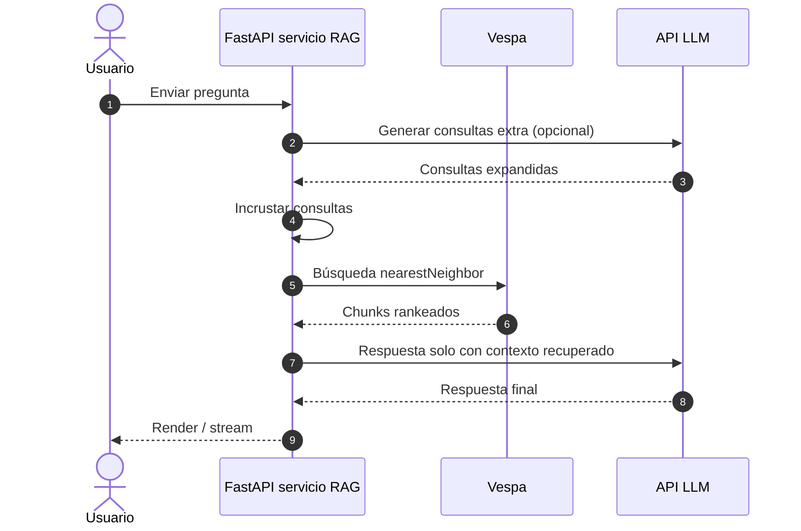
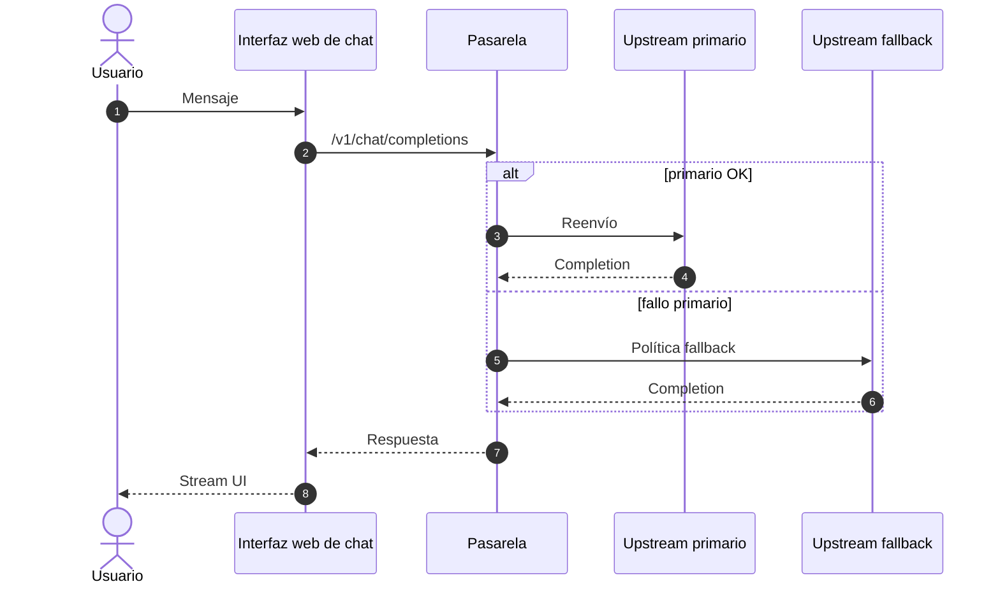
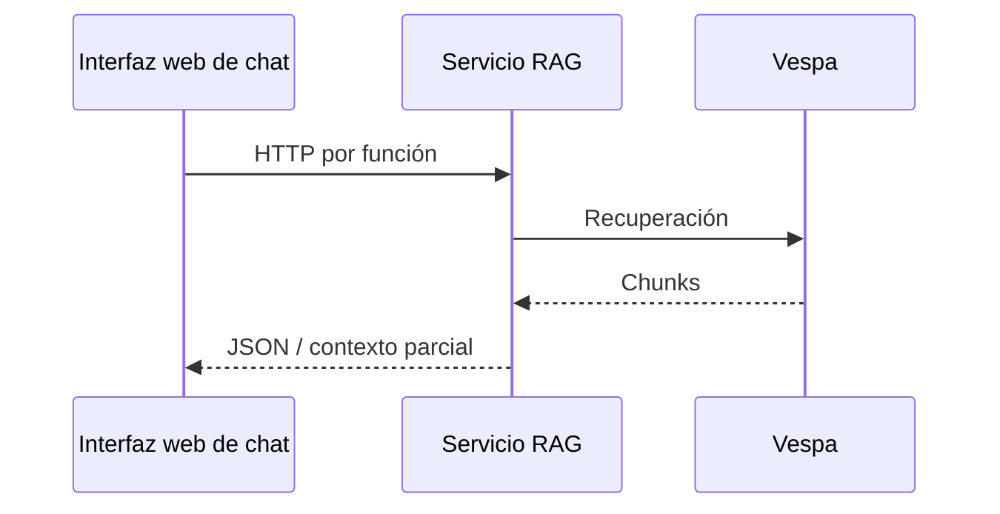

# Secuencias de peticiones

Vistas extremo a extremo sin incrustar URLs específicas del entorno.

## Pregunta RAG (UI del servicio RAG)

## Chat vía interfaz web de chat a través de la pasarela

## Opcional: la interfaz llama al servicio RAG para funciones RAG

Las rutas exactas dependen de la configuración del fork; rastrea llamadas desde los routers backend de la interfaz que referencian `IDENTIARAG_BASE_URL`.
