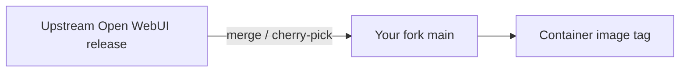

# Fork & upstream policy

How this solution relates to **upstream open-source** projects without losing the ability to merge security fixes.

## Open-WebUI fork

| Track | Policy |
|-------|--------|
| **Your fork (`open-webui`)** | Canonical deployment artifact (`open-webui:local` or org registry tag). |
| **Upstream `open-webui/open-webui`** | Periodically merge or cherry-pick releases matching your risk appetite. |
| **IdentIA-specific env** | Branding (`WEBUI_NAME`), integration env vars (`IDENTIARAG_BASE_URL`), and patches live in the fork or build args — document each deviation in the fork `CHANGELOG` or an internal patch list. |

### Merge strategy (recommended)

1. Tag your fork before merging upstream (`pre-merge-<date>`).
2. Merge upstream **minor** release branch or tag closest to your base (`0.8.12` baseline at doc time).
3. Resolve conflicts in `package-lock`, Svelte components, and `backend/open_webui/env.py`.
4. Run **lint + build + smoke chat** before promoting the image.

## IdentiaRAG lineage

IdentiaRAG derives from the open-source **identiarag** / **nyrag** lineage (see package metadata and `src/nyrag` tree). Treat **`identiarag`** as the supported package name for new modules; keep `nyrag` compatibility only as long as required by existing configs.

- Track upstream for **security** updates to dependencies (`fastapi`, `sentence-transformers`, `scrapy`, …).
- Re-run **ingestion + search smoke tests** after major upgrades because ranking behaviour can shift.

## Hermes Agent image

The reference deployment uses a **provider-published** image (`ghcr.io/hostinger/hvps-hermes-agent` pattern). You do not fork the image; you **pin by digest** or tag in compose and follow provider release notes.

## Documentation (`docu`)

- **Never** upstream `docu` to open-webui; it is an internal composite.
- Cross-link upstream user docs for features we do not duplicate (e.g. full Open WebUI feature matrix).

## Related

- [ADR 0003 — sibling layout](../adr/0003-identiarag-openwebui-sibling-layout.md)
- [Developer onboarding](onboarding.md)
