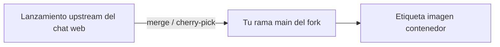

# Política de fork y *upstream*

Cómo se relaciona esta solución con proyectos **open source** de origen sin perder la capacidad de integrar parches de seguridad.

## Fork de la interfaz web de chat

| Pista | Política |
|-------|----------|
| **Tu fork (`open-webui`)** | Artefacto de despliegue canónico (etiqueta `open-webui:local` o registro de la org). |
| **Proyecto público de referencia** | Fusionar o *cherry-pick* periódicamente versiones según apetito de riesgo. |
| **Variables propias** | Marca (`WEBUI_NAME`), variables de integración (`IDENTIARAG_BASE_URL`) y parches en el fork o *build args* — documenta cada desviación en el `CHANGELOG` del fork o lista interna de parches. |

### Estrategia de merge (recomendada)

1. Etiqueta el fork antes de fusionar *upstream* (`pre-merge-<fecha>`).
2. Fusiona la rama o etiqueta **minor** de *upstream* más cercana a tu base (`0.8.12` en el momento de esta doc).
3. Resuelve conflictos en `package-lock`, componentes Svelte y `backend/open_webui/env.py`.
4. Ejecuta **lint + build + humo de chat** antes de promover la imagen.

## Linaje del servicio RAG

El servicio RAG deriva del linaje open source **identiarag** / **nyrag** (ver metadatos del paquete y árbol `src/nyrag`). Trata **`identiarag`** como nombre de paquete soportado para módulos nuevos; conserva compatibilidad `nyrag` solo mientras lo exijan configs existentes.

- Sigue *upstream* para **seguridad** en dependencias (`fastapi`, `sentence-transformers`, `scrapy`, …).
- Vuelve a ejecutar **tests de ingesta + búsqueda** tras upgrades mayores porque el comportamiento de ranking puede cambiar.

## Imagen del servicio de agentes

El despliegue de referencia usa una imagen **publicada por el proveedor de alojamiento** (patrón de registro + nombre de imagen en compose). No bifurcas la imagen; **fija por *digest*** o etiqueta en Compose y sigue las notas de versión del proveedor.

## Documentación (este repositorio)

- **Nunca** subas este sitio documental como *upstream* al proyecto de chat público; es un compuesto interno.
- Enlaza la documentación de usuario *upstream* para funciones que no dupliquemos (p. ej. matriz completa de funciones del chat web).

## Relacionado

- [ADR 0003 — layout en carpetas hermanas](../adr/0003-identiarag-openwebui-sibling-layout.md)
- [Incorporación de desarrolladores](onboarding.md)
