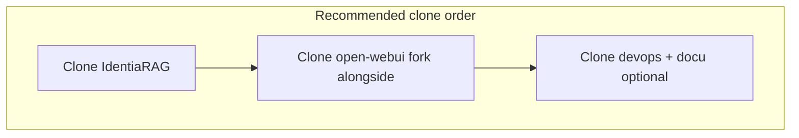

# Developer onboarding

Clone URLs and hostnames are **your organisation’s** — this page only lists commands and layout expectations.

## Repository layout

```text
<workspace>/
  IdentiaRAG/          # RAG engine + dev-stack.sh
  open-webui/          # fork (sibling of IdentiaRAG)
  devops/              # ops.sh, internal dashboards (optional sibling)
  docu/                # this documentation site
```

Override paths with `OPEN_WEBUI_ROOT`, `DEVOPS_IDENTIARAG_ROOT`, or `DEVOPS_STACK_SCRIPT` when layout differs.



## Prerequisites

| Tool | Notes |
|------|--------|
| **Git** | SSH or HTTPS to your remotes. |
| **Docker** | For Vespa, Open-WebUI image builds, compose stacks. |
| **Python 3.10–3.13** | IdentiaRAG `pyproject.toml` constraint. |
| **Node + npm** | Open-WebUI frontend/backend build (`package.json`). |
| **uv** (optional) | Faster Python env sync for IdentiaRAG upstream style. |

## IdentiaRAG — local Python

```bash
cd IdentiaRAG
python3 -m venv .venv
source .venv/bin/activate
pip install -e ".[dev]"
# optional: pip install -e ".[livekit]" for voice stack
identiarag --help
```

Run API locally per project README (`identiarag` CLI + uvicorn). Use `compose.yml` when you need real Vespa.

## Open-WebUI — build from fork

```bash
cd open-webui
npm install
# follow upstream README for full build; image build typically uses Dockerfile at repo root
docker build -t open-webui:local .
```

Your team may wrap this in `dev-stack.sh rebuild-webui` / `ops.sh deploy-webui`.

## Running tests (smoke)

- **IdentiaRAG**: `pytest` under `src/identiarag/tests` and `src/nyrag/tests` (see `pyproject.toml` `[tool.pytest]`).
- **Open-WebUI**: `npm run test:frontend`, `npm run lint` — heavy; use in CI or before releases.

## PR conventions (suggested)

| Rule | Why |
|------|-----|
| One logical change per PR | Easier review and rollback. |
| No secrets in diff | Use placeholders; rely on secret manager in deploy. |
| Update **this doc repo** when behaviour changes user-visible flows | Keeps `docu` truthful. |

## Related

- [Fork & upstream policy](fork-upstream-policy.md)
- [As-built deployment patterns](../as-built/deployment-patterns.md)
