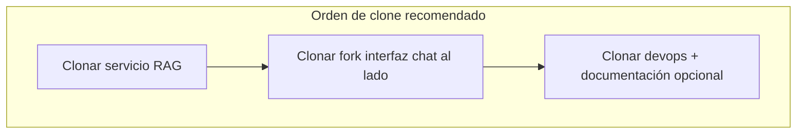

# Incorporación de desarrolladores

Las URLs de clone y los nombres de host son **de tu organización** — esta página solo lista comandos y expectativas de layout.

## Layout de repositorios

```text
<workspace>/
  IdentiaRAG/          # motor RAG + dev-stack.sh
  open-webui/          # fork (hermano del servicio RAG)
  devops/              # ops.sh, tableros internos (hermano opcional)
  documentacion/       # este sitio MkDocs
```

Sobrescribe rutas con `OPEN_WEBUI_ROOT`, `DEVOPS_IDENTIARAG_ROOT` o `DEVOPS_STACK_SCRIPT` si el layout difiere.



## Prerrequisitos

| Herramienta | Notas |
|-------------|--------|
| **Git** | SSH o HTTPS a vuestros remotos. |
| **Docker** | Para VectorDB, builds de imagen de la interfaz, stacks Compose. |
| **Python 3.10–3.13** | Restricción en `pyproject.toml` del servicio RAG. |
| **Node + npm** | Build frontend/backend de la interfaz (`package.json`). |
| **uv** (opcional) | Sincronización más rápida de entornos Python al estilo *upstream*. |

## Servicio RAG — Python local

```bash
cd IdentiaRAG
python3 -m venv .venv
source .venv/bin/activate
pip install -e ".[dev]"
# opcional: pip install -e ".[livekit]" para pila de voz
identiarag --help
```

Ejecuta la API local según el README del proyecto (`identiarag` CLI + uvicorn). Usa `compose.yml` cuando necesites VectorDB real.

## Interfaz web de chat — build desde fork

```bash
cd open-webui
npm install
# seguir README upstream para build completo; la imagen suele usar Dockerfile en la raíz
docker build -t open-webui:local .
```

Tu equipo puede envolver esto en `dev-stack.sh rebuild-webui` / `ops.sh deploy-webui`.

## Tests (humo)

- **Servicio RAG**: `pytest` bajo `src/identiarag/tests` y `src/nyrag/tests` (ver `pyproject.toml` `[tool.pytest]`).
- **Interfaz web de chat**: `npm run test:frontend`, `npm run lint` — pesados; usar en CI o antes de releases.

## Convenciones de PR (sugeridas)

| Regla | Por qué |
|-------|---------|
| Un cambio lógico por PR | Revisión y *rollback* más simples. |
| Sin secretos en el diff | Marcadores; secretos en despliegue. |
| Actualizar **este repo documental** cuando cambien flujos visibles al usuario | Mantiene la documentación alineada con la realidad. |

## Relacionado

- [Política de fork y upstream](fork-upstream-policy.md)
- [Patrones de despliegue as-built](../as-built/deployment-patterns.md)
