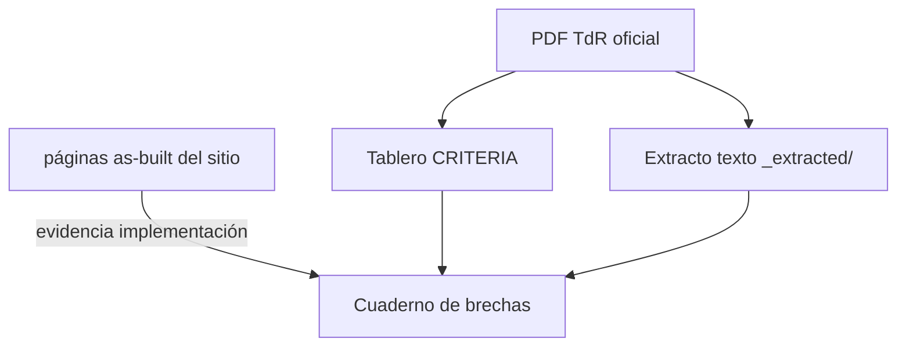

# Criterios de evaluación — instantánea del tablero

Esta página refleja el array JavaScript `CRITERIA` incrustado en **`map/dashboard.html`** (repositorio devops). Es la **rúbrica de puntuación** usada para el análisis de brechas (secciones **8.1–8.5**). Si cambia el script del tablero, actualiza esta instantánea en el mismo commit.

!!! note "Totales"
    Máximos por sección codificados en el tablero: **8.1 = 20**, **8.2 = 30**, **8.3 = 10**, **8.4 = 20**, **8.5 = 20**. La puntuación pre–prueba técnica usa los bloques experiencia + metodología + personal según la lógica del tablero (`threshold = 63` sobre escala **90** puntos en el texto de la UI).

---

## § 8.1 — Experiencia específica de la firma (20 pts)

### 8.1.1 — Capacidad Probada en Arquitecturas RAG (**max 10**)

**TdR wording (dashboard):** Proyectos con LLM + BD vectorial + corpus propio + pipeline completo (ingestión, chunking, embeddings, recuperación con citas). No cuentan chatbots de árbol de decisión.

| Nivel | Puntos |
|-------|--------|
| 0 proyectos | 0 |
| 2 proyectos | 5 |
| 3 o más proyectos | 10 |

### 8.1.2 — Experiencia en Contexto Normativo y Legal (**max 5**)

**TdR wording:** Al menos 1 proyecto para instituciones públicas, bufetes o entidades reguladoras, con objeto de sistematizar leyes, sentencias o reglamentos técnicos.

| Nivel | Puntos |
|-------|--------|
| No presenta proyecto | 0 |
| Presenta proyecto calificado | 5 |

### 8.1.3 — Experiencia en Soberanía y Seguridad de Datos (**max 5**)

**TdR wording:** Proyecto con BYOK, nubes privadas, o modelos open-source locales para privacidad total. Alternativamente, APIs estándar sin anonimización (2 pts).

| Nivel | Puntos |
|-------|--------|
| No presenta | 0 |
| APIs estándar sin anonimización | 2 |
| BYOK / nube privada / open-source local | 5 |

---

## § 8.2 — Metodología (30 pts)

### 8.2.1.1-A — Arquitectura de Orquestación Agéntica (**max 4**)

**TdR wording:** Diagramas de flujo detallados con estados, transiciones y mecanismos de reflexión. Arquitectura donde la IA puede volver atrás (Auditor devuelve tarea al Investigador si detecta contradicción).

| Nivel | Puntos |
|-------|--------|
| Insuficiente | 0 |
| Bueno: cadena lineal simple | 3 |
| Muy Bueno: loops de reflexión | 4 |

### 8.2.1.1-B — Auto-Corrección y Verificación de Alucinaciones (**max 3**)

**TdR wording:** Paso explícito de verificación donde un agente valida cada afirmación contra vectores recuperados (Grounding) antes de emitir respuesta.

| Nivel | Puntos |
|-------|--------|
| No explícito | 0 |
| Validación poco explícita | 2 |
| Verificación estructurada de citas | 3 |

### 8.2.1.1-C — Gestión de Contexto y Memoria (**max 3**)

**TdR wording:** Gestión de ventana de contexto, coherencia conversacional, priorización de normativa reciente sin olvidar leyes citadas al inicio.

| Nivel | Puntos |
|-------|--------|
| No explícito | 0 |
| Memoria estándar sin estrategia | 2 |
| Estrategia completa de ventana + priorización | 3 |

### 8.2.2-A — Calidad de Ingesta y Chunking (**max 3**)

**TdR wording:** Fragmentación semántica respetando Capítulos/Artículos/Párrafos. Solapamiento (overlap) inteligente. Manejo de documentos extensos.

| Nivel | Puntos |
|-------|--------|
| Insuficiente o genérico | 0 |
| Bueno: chunking fijo por caracteres | 2 |
| Muy Bueno: fragmentación semántica con overlap | 3 |

### 8.2.2-B — Estrategia de Recuperación Híbrida (**max 3**)

**TdR wording:** Combinación de búsqueda vectorial (por significado) con búsqueda léxica (BM25/palabras clave) + capa de Re-ranking (Cohere Re-rank o similar).

| Nivel | Puntos |
|-------|--------|
| No especifica método | 0 |
| Solo búsqueda vectorial | 2 |
| Híbrida + Re-ranking | 3 |

### 8.2.2-C — Citación Verificable y Grounding (**max 2**)

**TdR wording:** Interfaz muestra enlace directo o referencia al PDF original con párrafo citado resaltado. Garantía de trazabilidad.

| Nivel | Puntos |
|-------|--------|
| No se garantiza | 0 |
| Citas de texto sin vinculación a fuente | 1 |
| Grounding completo con enlace a PDF original | 2 |

### 8.2.3-A — Control de Cifrado y Acceso (BYOK) (**max 3**)

**TdR wording:** Cifrado Administrado por el Cliente. Ni siquiera el proveedor cloud puede leer los datos sin la llave que custodia el MAP.

| Nivel | Puntos |
|-------|--------|
| Seguridad genérica | 0 |
| Cifrado gestionado por proveedor cloud | 2 |
| BYOK real con Key Vault del MAP | 3 |

### 8.2.3-B — Privacidad en Uso de LLMs (Aislamiento) (**max 2**)

**TdR wording:** Garantía técnica + contractual (Enterprise APIs o modelos locales) de que datos no se usan para re-entrenar modelos de terceros. DPA con OpenAI/Anthropic + opinión jurídica Ley 172-13.

| Nivel | Puntos |
|-------|--------|
| APIs públicas sin aislamiento | 0 |
| APIs comerciales sin detalle privacidad | 1 |
| Enterprise APIs con DPA + no-entrenamiento | 2 |

### 8.2.3-C — Arquitectura de Red y Residencia de Datos (**max 2**)

**TdR wording:** VPC con Private Links. Tráfico nunca por internet abierto. Residencia de datos en regiones permitidas por normativa dominicana.

| Nivel | Puntos |
|-------|--------|
| SaaS abierta en servidores públicos | 0 |
| Cloud estándar sin aislamiento de red | 1 |
| VPC + Private Links + residencia | 2 |

### 8.2.4-A — Programa de Capacitación Técnica BOT (**max 2**)

**TdR wording:** Talleres hands-on para equipo TI del MAP: administración de BD vectorial, prompt engineering, monitoreo de costos de API.

| Nivel | Puntos |
|-------|--------|
| Plan vago o genérico | 0 |
| Capacitaciones estándar para usuarios finales | 1 |
| Talleres técnicos específicos para TI | 2 |

### 8.2.4-B — Documentación de Arquitectura y Código (**max 2**)

**TdR wording:** Diagramas de lógica agéntica, diccionario de embeddings, código fuente comentado y versionado en repositorio privado del MAP.

| Nivel | Puntos |
|-------|--------|
| Documentación vaga o inexistente | 0 |
| Manuales de usuario funcionales básicos | 1 |
| Documentación técnica exhaustiva + código comentado | 2 |

### 8.2.4-C — Estrategia de Transición y Shadowing (**max 1**)

**TdR wording:** Período de sombra donde MAP opera bajo supervisión antes del cierre. Fase de paralelo (30 días) de acompañamiento.

| Nivel | Puntos |
|-------|--------|
| Cierre abrupto sin acompañamiento | 0 |
| Período de shadowing con supervisión | 1 |

---

## § 8.3 — Plan de Trabajo (10 pts)

### 8.3.1 — Plan de Trabajo y Cronograma (**max 10**)

**TdR wording:** Plan coherente con metodología, actividades detalladas por frente, métodos ágiles, integración de componentes, plan de salida, cronograma con hitos y entregables.

| Nivel | Puntos |
|-------|--------|
| No presenta plan ni cronograma | 0 |
| Satisfactorio: descripción general | 3 |
| Bueno: coherente pero sin métodos ágiles | 7 |
| Muy Bueno: detallado + ágil + integración | 10 |

---

## § 8.4 — Calificaciones del Personal Clave (20 pts)

### 8.4.1-A — Ingeniero IA — Experiencia adicional (**max 2**)

**TdR wording:** Años adicionales al mínimo de 2 años en arquitecturas RAG y orquestación de agentes.

| Nivel | Puntos |
|-------|--------|
| Solo experiencia mínima | 0 |
| 1–2 años adicionales | 1 |
| Más de 2 años adicionales | 2 |

### 8.4.1-B — Ingeniero IA — Certificaciones (**max 2**)

**TdR wording:** Certificaciones adicionales Azure / Google / AWS a la requerida.

| Nivel | Puntos |
|-------|--------|
| Solo certificación mínima | 0 |
| 1 certificación adicional | 1 |
| 2 certificaciones adicionales | 2 |

### 8.4.1-C — Ingeniero IA — Postgrado (**max 2**)

**TdR wording:** Doctorado/Maestría/Especialidad en IA, Ciencia de Datos o Machine Learning.

| Nivel | Puntos |
|-------|--------|
| Sin postgrado especificado | 0 |
| Postgrado en área especificada | 2 |

### 8.4.2-A — Ingeniero Datos — Experiencia adicional (**max 2**)

**TdR wording:** Años adicionales en pipelines ETL/ELT, RAG, chunking. Suma hasta 2 pts (1 pt por cada componente adicional).

| Nivel | Puntos |
|-------|--------|
| Solo mínimo | 0 |
| 1 componente adicional | 1 |
| 2+ componentes adicionales | 2 |

### 8.4.2-B — Ingeniero Datos — Certificaciones (**max 2**)

**TdR wording:** Certificaciones adicionales Azure / Google / AWS.

| Nivel | Puntos |
|-------|--------|
| Solo mínima | 0 |
| 1 adicional | 1 |
| 2 adicionales | 2 |

### 8.4.2-C — Ingeniero Datos — Postgrado (**max 2**)

**TdR wording:** Doctorado/Maestría en Ingeniería de Datos, Ciencia de Datos o IA.

| Nivel | Puntos |
|-------|--------|
| Sin postgrado | 0 |
| Postgrado en área | 2 |

### 8.4.3-A — Consultor Legal — Experiencia adicional (**max 4**)

**TdR wording:** Años adicionales en: (1) sistematización de textos legales, (2) curaduría de corpus normativos, (3) etiquetado semántico. Suma hasta 4 pts.

| Nivel | Puntos |
|-------|--------|
| Solo mínimo | 0 |
| 1 componente | 1 |
| 2 componentes | 2 |
| 3 componentes completos | 4 |

### 8.4.3-B — Consultor Legal — Postgrado (**max 4**)

**TdR wording:** Doctorado/Maestría/Especialidad en Derecho Administrativo, Teoría del Derecho, LegalTech o Derecho Digital/IA.

| Nivel | Puntos |
|-------|--------|
| Sin postgrado especificado | 0 |
| Postgrado en área | 4 |

---

## § 8.5 — Prueba Técnica Obligatoria (20 pts)

### 8.5.1 — Exactitud y Citación (**max 8**)

**TdR wording:** La IA presenta respuesta legal correcta y muestra link/página del PDF original sobre 20 preguntas del Golden Dataset. Umbral: 75% respuestas correctas.

| Nivel | Puntos |
|-------|--------|
| Respuestas incorrectas o sin citación | 0 |
| Parcial: 50–74% correctas | 4 |
| Completo: 75%+ correctas con link al PDF | 8 |

### 8.5.2 — Ausencia de Alucinaciones (**max 5**)

**TdR wording:** La IA no inventa leyes ni artículos. Máximo 5% alucinaciones sobre respuestas emitidas (excluye abstenciones).

| Nivel | Puntos |
|-------|--------|
| Inventa leyes o artículos | 0 |
| Sin alucinaciones detectadas | 5 |

### 8.5.3 — Velocidad y Latencia (**max 3**)

**TdR wording:** Respuesta generada en <15–20 segundos (se permite streaming palabra por palabra).

| Nivel | Puntos |
|-------|--------|
| Latencia >20s | 0 |
| Respuesta en <20s | 3 |

### 8.5.4 — Interfaz y Usabilidad (**max 4**)

**TdR wording:** Información jurídica presentada de forma clara, de fácil consumo, intuitiva. Incluye split-view con PDF fuente.

| Nivel | Puntos |
|-------|--------|
| Interfaz poco clara o confusa | 0 |
| Clara e intuitiva con split-view | 4 |

---

## Diagrama de trazabilidad

## Relacionado

- [Índice TdR y brechas](index.md)  
- [Cuaderno de brechas](gap-analysis-workbook.md)
