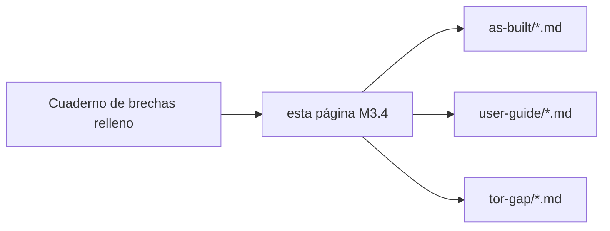

# Hoja de ruta documental desde brechas (M3.4)

Tras rellenar el [Cuaderno de brechas](gap-analysis-workbook.md), promueve cada brecha **alta / bloqueante** a un **entregable documental concreto** en la tabla inferior. Esta página es el puente entre criterios del pliego y el mantenimiento de **este sitio**.

## Cómo usarlo

1. Exporta o copia puntuaciones desde `map/dashboard.html` (botones Markdown/CSV).  
2. Por cada criterio con **Cobertura = Ninguna** o **Parcial** y **riesgo alto**, añade una fila abajo.  
3. Abre un issue de seguimiento (o sub-hito) por fila; enlaza el PR que actualice la página referenciada.

## Mapeo sugerido (criterio → ancla existente en este sitio)

Matriz inicial — **edita** tras el taller; los ids coinciden con [Criterios desde el tablero](criteria-from-dashboard.md).

| Criterio | Tema de brecha probable | Extender primero estas páginas | Página nueva (si hace falta) |
|----------|-------------------------|------------------------------|------------------------------|
| 8.1.1 | Corpus RAG + citas | `as-built/identiarag-software.md`, `sequence-requests.md` | `as-built/rag-citation-evidence.md` |
| 8.1.2 | Corpus legal / sector público | `user-guide/identiarag-for-analysts.md` | `tor-gap/corpus-map.md` (ámbito normas MAP) |
| 8.1.3 | BYOK / soberanía | `as-built/inference-gateway.md`, `network-security-matrix.md` | `as-built/byok-and-dpa.md` |
| 8.2.1.x | Bucles de agente / reflexión | *nueva* | `as-built/agent-orchestration.md` |
| 8.2.2.x | Recuperación híbrida + rerank | `identiarag-software.md` | `as-built/vespa-ranking.md` |
| 8.2.2-C | UI de anclaje PDF | `open-webui-software.md` | `user-guide/citations-and-pdf.md` |
| 8.2.3.x | VPC / Private Link / residencia | `network-security-matrix.md` | `as-built/cloud-landing-zone.md` |
| 8.2.4.x | Formación BOT + *shadowing* | `user-guide/*`, `operations-runbook.md` | `as-built/bot-training-plan.md` |
| 8.3.1 | Plan de trabajo / ágil | `deployment-patterns.md` | `tor-gap/delivery-plan-outline.md` |
| 8.4.x | Evidencia de personal | *RRHH externo* | `tor-gap/personnel-evidence-checklist.md` (sin datos CV) |
| 8.5.x | *Golden dataset* + prueba técnica | *nueva* | `as-built/golden-dataset-and-eval.md` |

## Definición de hecho (por fila de brecha)

- [ ] El texto as-built coincide con comportamiento **observable** (versión, flag de entorno o captura en anexo privado).  
- [ ] Sin secretos en el diff.  
- [ ] `ROADMAP-MILESTONES.md` actualizado si se entregó un nuevo trozo de fase 1/2.  
- [ ] Fila del criterio en el tablero actualizada con enlace a evidencia (interno).

## Relacionado

- [Índice TdR y brechas](index.md)  
- [Hitos del roadmap](../ROADMAP-MILESTONES.md) — fase 4 publicación.
