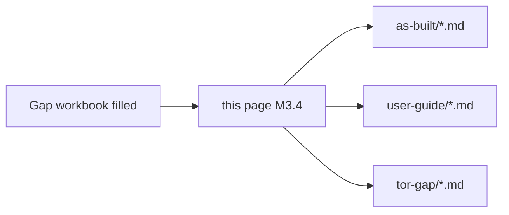

# Documentation roadmap from gaps (M3.4)

After you fill the [Gap workbook](gap-analysis-workbook.md), promote each **High / blocking** gap into a **concrete doc deliverable** below. This page is the backlog bridge between tender criteria and `docu` maintenance.

## How to use

1. Export or copy scores from `map/dashboard.html` (Markdown/CSV buttons).  
2. For every criterion with **Coverage = None** or **Partial** and **risk = high**, add a row in the table below.  
3. Open a tracking issue (or sub-milestone) per row; link the PR that updates the referenced page.

## Suggested mapping (criterion → existing `docu` anchor)

Starter matrix — **edit** after your workshop; IDs match [Criteria from dashboard](criteria-from-dashboard.md).

| Criterion | Likely gap theme | Extend these pages first | New page (if needed) |
|-----------|------------------|--------------------------|----------------------|
| 8.1.1 | RAG corpus + citations | `as-built/identiarag-software.md`, `sequence-requests.md` | `as-built/rag-citation-evidence.md` |
| 8.1.2 | Legal / public-sector corpus | `user-guide/identiarag-for-analysts.md` | `tor-gap/corpus-map.md` (MAP norms scope) |
| 8.1.3 | BYOK / sovereignty | `as-built/inference-gateway.md`, `network-security-matrix.md` | `as-built/byok-and-dpa.md` |
| 8.2.1.x | Agent loops / reflection | *new* | `as-built/agent-orchestration.md` |
| 8.2.2.x | Hybrid retrieval + rerank | `identiarag-software.md` | `as-built/vespa-ranking.md` |
| 8.2.2-C | PDF grounding UI | `open-webui-software.md` | `user-guide/citations-and-pdf.md` |
| 8.2.3.x | VPC / Private Link / residency | `network-security-matrix.md` | `as-built/cloud-landing-zone.md` |
| 8.2.4.x | BOT training + shadowing | `user-guide/*`, `operations-runbook.md` | `as-built/bot-training-plan.md` |
| 8.3.1 | Work plan / agile | `deployment-patterns.md` | `tor-gap/delivery-plan-outline.md` |
| 8.4.x | Personnel evidence | *external HR* | `tor-gap/personnel-evidence-checklist.md` (non-CV data) |
| 8.5.x | Golden dataset + technical test | *new* | `as-built/golden-dataset-and-eval.md` |

## Definition of done (per gap row)

- [ ] As-built text matches **observable** behaviour (version, env flag, or screenshot in private annex).  
- [ ] No secrets in diff.  
- [ ] `ROADMAP-MILESTONES.md` nudged if a new Phase 1/2 slice was delivered.  
- [ ] Dashboard criterion row updated with evidence link (internal).

## Related

- [Tor-gap hub](index.md)  
- [Milestone roadmap](../ROADMAP-MILESTONES.md) — Phase 4 publishing.
