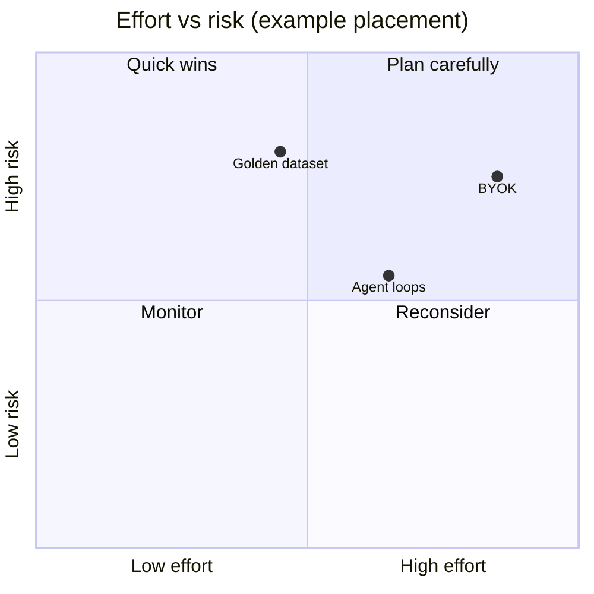

# Gap analysis workbook (M3.2–M3.3)

Use this template after refreshing the [TdR extract](index.md#extraction-tooling) and updating the **dashboard** scores.

## 1. TdR ↔ implementation matrix

Duplicate the block per criterion (or import from dashboard CSV export).

| Criterion ID | Requirement summary | As-built evidence (link to `docu` section / repo path) | Coverage | Gap / action |
|----------------|--------------------|--------------------------------------------------------|----------|----------------|
| 8.1.1 | … | … | Full / Partial / None | … |
| 8.1.2 | … | … | … | … |

**Coverage legend**

- **Full** — demonstrable in production or staging with artefacts.  
- **Partial** — prototype exists, missing hardening or MAP-specific policy.  
- **None** — not started.

*(Replace placeholder points with your workshop outcomes.)*

## 2. Technical gap report outline (M3.3)

1. **Executive summary** — top 5 gaps blocking threshold **63/90**.  
2. **Clustered findings** — Security / RAG quality / Agentic / Ops / Personnel.  
3. **Effort & dependency** — rough T-shirt sizes (S/M/L) and prerequisite ordering.  
4. **Documentation actions** — which `docu` pages to extend (link to roadmap).  
5. **Residual risks** — items that cannot close before EOI without external input.

## 3. Dashboard alignment (M3.5)

When the HTML dashboard adds new indicators, map each widget to:

- a **criterion ID** (e.g. `8.2.2-B`), and  
- one or more **as-built** pages (e.g. `as-built/identiarag-software.md`).

Keep the mapping table here or in the devops `README` next to `map/`.

## Related

- [Criteria from dashboard](criteria-from-dashboard.md)  
- [Executive summary](tdr-executive-summary.md)
