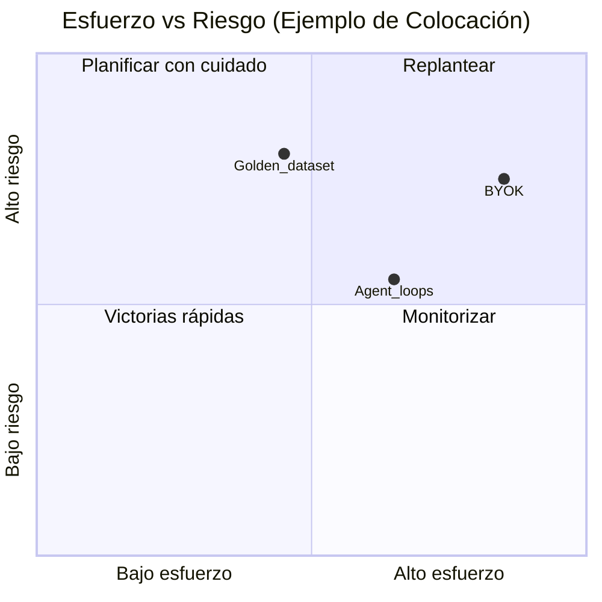

# Cuaderno de análisis de brechas (M3.2–M3.3)

Usa esta plantilla tras refrescar el [extracto del TdR](index.md) (sección *Herramienta de extracción*) y actualizar las puntuaciones del **tablero**.

## 1. Matriz TdR ↔ implementación

Duplica el bloque por criterio (o impórtalo desde export CSV del tablero).

| ID criterio | Resumen del requisito | Evidencia as-built (enlace a sección de este sitio / ruta repo) | Cobertura | Brecha / acción |
|-------------|----------------------|----------------------------------------------------------------|-----------|-----------------|
| 8.1.1 | … | … | Completa / Parcial / Ninguna | … |
| 8.1.2 | … | … | … | … |

**Leyenda de cobertura**

- **Completa** — demostrable en producción o staging con artefactos.  
- **Parcial** — prototipo existe, falta endurecimiento o política específica MAP.  
- **Ninguna** — no iniciado.

*(Sustituye los puntos de ejemplo por los resultados de vuestro taller.)*

## 2. Esquema de informe técnico de brechas (M3.3)

1. **Resumen ejecutivo** — top 5 brechas que bloquean el umbral **63/90**.  
2. **Hallazgos agrupados** — Seguridad / calidad RAG / agentes / Ops / Personal.  
3. **Esfuerzo y dependencia** — tallas orientativas (S/M/L) y orden de prerequisitos.  
4. **Acciones documentales** — qué páginas de este sitio extender (enlace a la hoja de ruta).  
5. **Riesgos residuales** — ítems que no pueden cerrarse antes del EOI sin aporte externo.

## 3. Alineación con tablero (M3.5)

Cuando el tablero HTML añada indicadores nuevos, mapea cada widget a:

- un **id de criterio** (p. ej. `8.2.2-B`), y  
- una o más páginas **as-built** (p. ej. `as-built/identiarag-software.md`).

Mantén la tabla aquí o en el `README` de devops junto a `map/`.

## Relacionado

- [Criterios desde el tablero](criteria-from-dashboard.md)  
- [Resumen ejecutivo](tdr-executive-summary.md)
