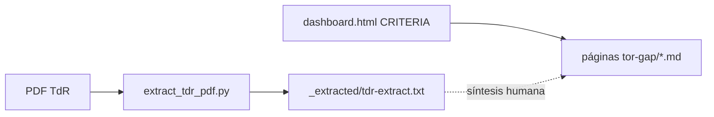

# Términos de referencia (TdR) y análisis de brechas

Esta sección enlaza el contexto de contratación **MAP–BID**, el **tablero interactivo** versionado en el repositorio devops y la documentación de **implementación** (`as-built/`).

!!! warning "Legal y confidencialidad"
    El TdR autoritativo es el PDF firmado. El extracto automático bajo `docs/tor-gap/_extracted/` está **gitignored** — regenéralo con `python scripts/extract_tdr_pdf.py` tras colocar `incoming/tdr.pdf`. No publiques extractos fuera de canales autorizados.

## Contenido

| Página | Uso |
|--------|-----|
| [Resumen ejecutivo (TdR)](tdr-executive-summary.md) | M3.1 — Objetivos, modalidad BOT, alcance breve (referencias bilingües). |
| [Criterios de evaluación (desde tablero)](criteria-from-dashboard.md) | Rúbrica estructurada reflejada desde `dashboard.html` (array `CRITERIA`). |
| [Cuaderno de análisis de brechas](gap-analysis-workbook.md) | M3.2–M3.3 — plantilla matricial + esquema de informe de brechas. |
| [Hoja de ruta documental desde brechas](documentation-roadmap-from-gaps.md) | M3.4 — convertir brechas en *backlog* doc. |
| [Notas del organizador](organizer-notes.md) | Pega **tus** notas; revisa antes de compartir. |

## Herramienta de extracción

```bash
python3 -m venv .venv   # si aún no existe
.venv/bin/pip install -r requirements-docs.txt
python3 scripts/extract_tdr_pdf.py
# salida: docs/tor-gap/_extracted/tdr-extract.txt
```

## Fuente de verdad del tablero

El tablero HTML incrusta la misma estructura de puntuación que los capítulos de evaluación del TdR (secciones **8.1–8.5**). Ver [Referencias internas](../meta/internal-references.md) para la ruta a `dashboard.html` dentro del checkout devops.



## Roadmap relacionado

[Hitos del roadmap](../ROADMAP-MILESTONES.md) — fase 3.
