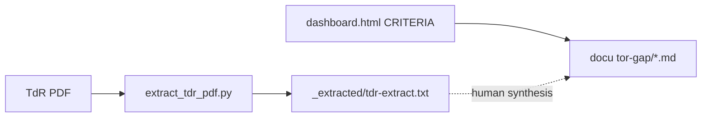

# Terms of Reference (TdR) & gap analysis

This section links **MAP–BID** procurement context, the **interactive dashboard** encoded in the devops repository, and **implementation** documentation (`as-built/`).

!!! warning "Legal & confidentiality"
    The authoritative TdR is the signed PDF. The machine extract under `docs/tor-gap/_extracted/` is **gitignored** — regenerate with `python scripts/extract_tdr_pdf.py` after placing `incoming/tdr.pdf`. Do not publish extracts outside authorised channels.

## Contents

| Page | Purpose |
|------|---------|
| [Executive summary (TdR)](tdr-executive-summary.md) | M3.1 — Objectives, BOT modality, scope in brief (bilingual cues). |
| [Evaluation criteria (from dashboard)](criteria-from-dashboard.md) | Structured rubric mirrored from `dashboard.html` (`CRITERIA` array). |
| [Gap analysis workbook](gap-analysis-workbook.md) | M3.2–M3.3 — matrix template + gap report outline. |
| [Documentation roadmap from gaps](documentation-roadmap-from-gaps.md) | M3.4 — turn gaps into doc backlog. |
| [Organizer notes](organizer-notes.md) | Paste **your** notes; scrub before sharing. |

## Extraction tooling

```bash
python3 -m venv .venv   # if not already created
.venv/bin/pip install -r requirements-docs.txt
python3 scripts/extract_tdr_pdf.py
# output: docs/tor-gap/_extracted/tdr-extract.txt
```

## Dashboard source of truth

The HTML dashboard embeds the same scoring structure as the TdR evaluation chapters (sections **8.1–8.5**). See [Internal references](../meta/internal-references.md) for the path to `dashboard.html` inside the devops checkout.



## Related roadmap

[Milestone roadmap](../ROADMAP-MILESTONES.md) — Phase 3.
