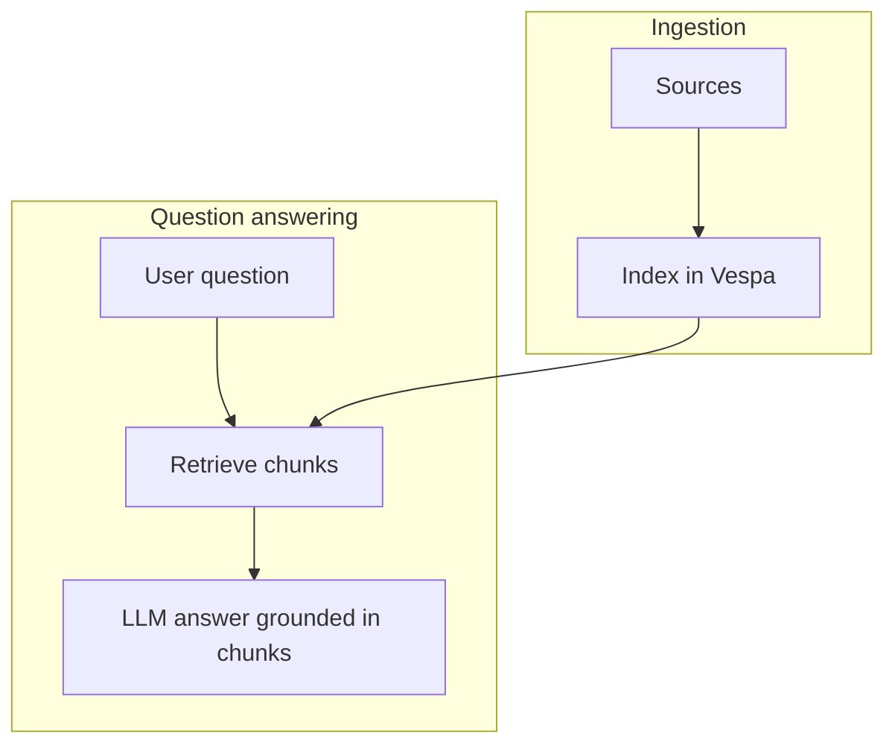

# IdentiaRAG — analyst / operator basics

For people who **run projects** or **review answers**, not necessarily developers.

## What IdentiaRAG does

1. Ingests **websites** or **documents** according to a YAML config.
2. Indexes chunks into **Vespa** for hybrid / vector search.
3. At question time: expands queries, retrieves top chunks, and asks an **LLM** to answer **only from retrieved context**.

## Projects and settings

- Operators choose an **active project** in the UI; user settings persist under the server user’s home directory pattern described in [Data & storage](../as-built/data-and-storage.md).
- Changing retrieval parameters (`hits`, `k`, etc.) affects recall vs precision — document your organisation’s recommended defaults.

## When answers look wrong

| Symptom | Check |
|---------|--------|
| “I don’t see my document” | Ingestion job completed? Correct project selected? |
| Answer ignores new content | Re-index after source changes. |
| Empty retrieval | Vespa health; embedding model availability; credentials for Vespa Cloud if used. |

Escalate to developers with **timestamps** and **project id**, not with API keys.

## Related

- [IdentiaRAG — software](../as-built/identiarag-software.md)
- [Operations runbook](../as-built/operations-runbook.md)
