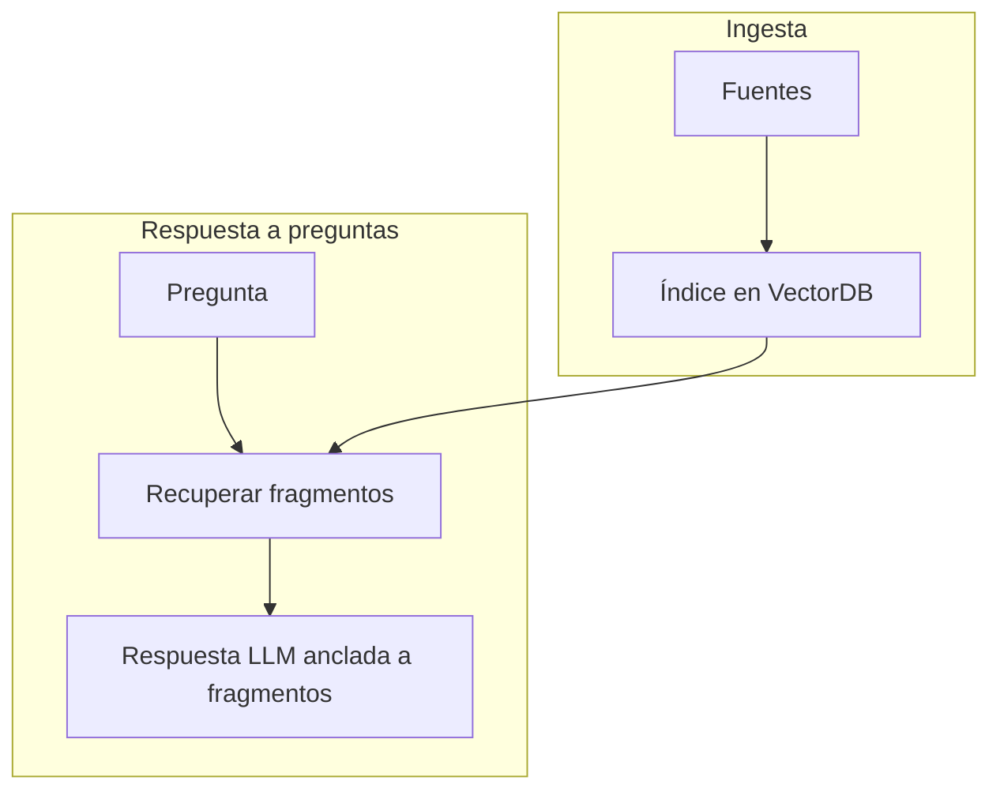

# Servicio RAG — nociones para analistas / operadores

Para quienes **ejecutan proyectos** o **revisan respuestas**, no necesariamente desarrolladores.

## Qué hace el servicio RAG

1. Ingiere **sitios web** o **documentos** según un config YAML.
2. Indexa fragmentos en **VectorDB** para búsqueda híbrida / vectorial.
3. En la pregunta: expande consultas, recupera los mejores fragmentos y pide a un **LLM** que responda **solo** con el contexto recuperado.

## Proyectos y ajustes

- Los operadores eligen un **proyecto activo** en la UI; los ajustes persisten según el patrón de directorio de inicio descrito en [Datos y almacenamiento](../as-built/data-and-storage.md).
- Cambiar parámetros de recuperación (`hits`, `k`, etc.) afecta *recall* vs precisión — documenta los valores recomendados por tu organización.

## Cuando las respuestas fallan

| Síntoma | Comprobar |
|---------|-----------|
| «No veo mi documento» | ¿Terminó el trabajo de ingesta? ¿Proyecto correcto seleccionado? |
| La respuesta ignora contenido nuevo | Reindexar tras cambios en fuentes. |
| Recuperación vacía | Salud del VectorDB; disponibilidad del modelo de embeddings; credenciales de nube gestionada si aplica. |

Escala a desarrollo con **marcas de tiempo** e **id de proyecto**, no con claves API.

## Relacionado

- [Servicio RAG — software](../as-built/identiarag-software.md)
- [Runbook operativo](../as-built/operations-runbook.md)
