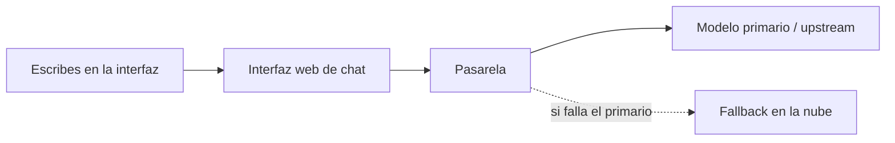

# Modelos y pasarela de inferencia (vista usuario)

Cómo deben pensar en los modelos los **usuarios de chat** y los **admins** cuando una **pasarela compatible OpenAI** (u otra equivalente) delante de los proveedores.

## Modelo mental

- **No pegues claves maestras de proveedor en la nube** en campos arbitrarios. Los admins configuran la pasarela; los usuarios eligen **nombres de modelo** expuestos por la pasarela.
- Un **alias lógico** (nombre de ejemplo: `lm-auto`) puede ocultar si la respuesta vino de GPU en estación o de API en la nube — es política a propósito.

## Admin: configurar una conexión

1. Abre **Ajustes → Conexiones** (o equivalente).
2. Pon la URL base **OpenAI API** en el endpoint de la **pasarela** (URL interna o HTTPS vía *reverse proxy*).
3. Pon la **clave API** con el valor de la **clave maestra de pasarela** que te haya dado operaciones — no tu clave personal del agregador en la nube salvo que la política lo permita explícitamente.
4. Guarda y refresca la lista de modelos.

!!! warning "Higiene de secretos"
    Las claves van en configuración servidor o almacenes de secretos. Rótalas si alguna vez se compartieron en tickets o chats.

## Usuario: elegir modelo

1. Abre el selector de modelo en la cabecera del chat.
2. Elige el alias que documente vuestra organización (p. ej. alias híbrido local+nube frente a solo nube).
3. Si falla con errores de conexión, el *upstream* primario puede estar caído — un *fallback* configurado debería responder si está sano.

## Modelos de pasarela frente a funciones del servicio RAG

- Los **modelos de pasarela** responden *chat completions* generales.
- Las **funciones del servicio RAG** (si están integradas) usan la base API del servicio RAG que configuren los operadores (patrón `IDENTIARAG_BASE_URL`). Los usuarios pueden ver herramientas o *pipelines* distintos según personalización del fork.

## Relacionado

- [Pasarela de inferencia — as-built](../as-built/inference-gateway.md)
- [Uso básico de la interfaz de chat](open-webui-basics.md)
