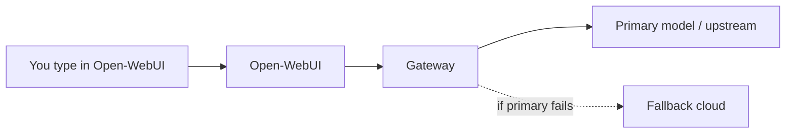

# Models & inference gateway (user-facing)

How **chat users** and **admins** should think about models when a **LiteLLM** (or compatible) gateway sits in front of providers.

## Mental model

- **You never paste cloud provider master keys** into random fields. Admins configure the gateway; users pick **model names** exposed by the gateway.
- A **logical alias** (example name: `lm-auto`) may hide whether the answer came from a workstation GPU or a cloud API — that is intentional policy.

## Admin: configuring a connection

1. Open **Settings → Connections** (or equivalent).
2. Set **OpenAI API** base URL to your **gateway** endpoint (internal URL or HTTPS through reverse proxy).
3. Set **API key** to the **gateway master key** value your operator issued — not your personal OpenRouter key unless policy explicitly allows it.
4. Save and refresh the model list.

!!! warning "Secrets hygiene"
    Keys belong in server-side configuration or secret stores. Rotate them if they were ever shared in chat logs or tickets.

## User: picking a model

1. Open the model picker in the chat header.
2. Choose the alias your organisation documented (e.g. hybrid local+cloud alias vs pure cloud).
3. If responses fail with connection errors, the primary upstream may be offline — a configured fallback should still answer when healthy.

## IdentiaRAG vs gateway models

- **Gateway models** answer general chat completions.
- **IdentiaRAG** features (when integrated) use the IdentiaRAG API base configured by operators (`IDENTIARAG_BASE_URL` pattern). Users may see separate tools or pipelines depending on fork customisation.

## Related

- [Inference gateway — as-built](../as-built/inference-gateway.md)
- [Open-WebUI basics](open-webui-basics.md)
