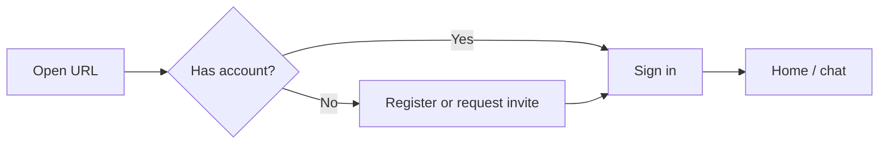

# Open-WebUI — user basics

For **end users** and **workspace admins** using the deployed IdentIA-branded Open WebUI fork.

## First sign-in

1. Open the URL provided by your administrator (HTTPS recommended).
2. Complete registration if the instance allows self-signup; otherwise use the account your admin created.
3. Set your profile and default model preferences under **Settings** (labels may vary slightly by version).

## Starting a chat

- Use **New chat** to start a fresh thread.
- Attach files or use **#** commands (if enabled) for knowledge / web features — see upstream Open WebUI docs for the exact feature set in your version (`0.8.x` fork baseline).

## Roles (typical)

| Role | Typical capabilities |
|------|----------------------|
| **User** | Chat, use allowed models, personal history. |
| **Admin** | Model connections, user management, system prompts, feature toggles. |

Exact RBAC is configured in your deployment; do not assume defaults from upstream screenshots.

## IdentIA branding note

The fork may set `WEBUI_NAME` to **IdentIA** (see `backend/open_webui/env.py`). UI copy and favicon may still show upstream assets unless your fork replaces them.

## Related

- [Models & gateway](models-and-gateway.md)
- [Open-WebUI — software](../as-built/open-webui-software.md) (technical background)
