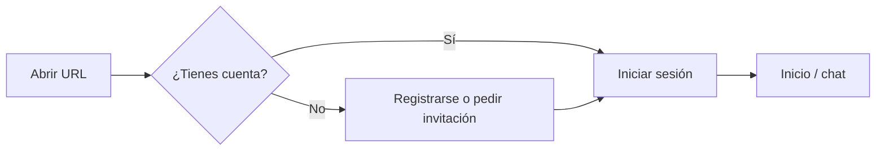

# Interfaz web de chat — uso básico

Para **usuarios finales** y **administradores del espacio de trabajo** con el fork desplegado (marca y textos pueden personalizarse en vuestro entorno).

## Primer acceso

1. Abre la URL que te facilite el administrador (HTTPS recomendado).
2. Completa el registro si la instancia permite *self-signup*; si no, usa la cuenta que te haya creado el admin.
3. Ajusta perfil y modelo por defecto en **Ajustes** (las etiquetas pueden variar ligeramente según versión).

## Iniciar un chat

- Usa **Nuevo chat** para un hilo limpio.
- Adjunta archivos o usa comandos **#** (si están habilitados) para conocimiento / web — consulta la documentación del proyecto de chat *upstream* para el conjunto exacto de funciones en tu versión (línea base de fork `0.8.x`).

## Roles (típico)

| Rol | Capacidades habituales |
|-----|------------------------|
| **Usuario** | Chat, modelos permitidos, historial personal. |
| **Admin** | Conexiones de modelos, gestión de usuarios, *prompts* de sistema, *feature toggles*. |

El RBAC exacto lo configura vuestro despliegue; no asumas los valores por defecto de capturas *upstream*.

## Nota sobre nombre de instancia

El fork puede fijar `WEBUI_NAME` (ver `backend/open_webui/env.py`). La copia de la UI y el favicon pueden seguir mostrando recursos *upstream* salvo que el fork los sustituya.

## Relacionado

- [Modelos y pasarela](models-and-gateway.md)
- [Interfaz web de chat — software](../as-built/open-webui-software.md) (fondo técnico)
